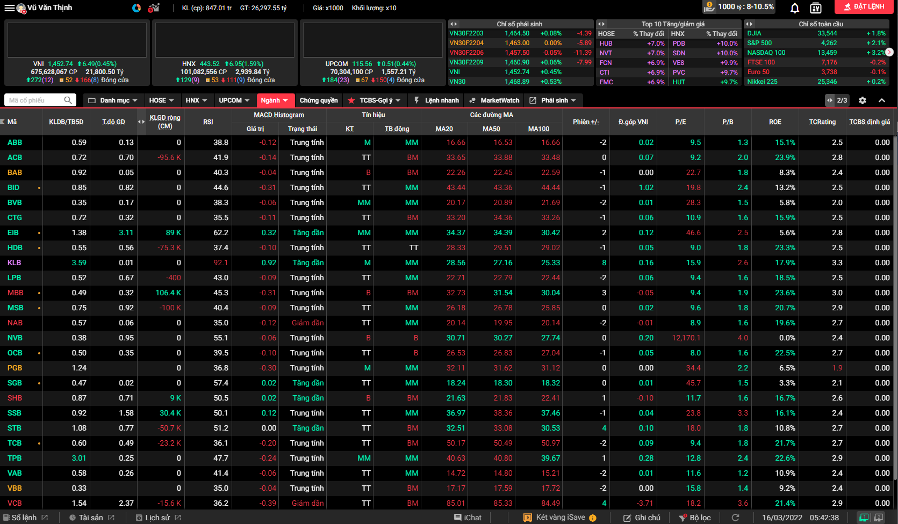

<h2 align="center">Vietnam Stock Market data extraction from TCBS & SSI with Python</h2>

vnstock is a Python package to retrieve the Vietnam stock market data from [TCBS](https://tcbs.com.vn) and [SSI]('https://iboard.ssi.com.vn/').

vnstock allows the user to download historical, intraday stock data and market insights from [TCBS](https://tcbs.com.vn).

vnstock is relying on public/private APIs to provide stock data. It is **FREE** and has **NO LIMITATIONS**.


## 🛠 Installation

To get this package working, you will need to **install it via pip** (with a Python 3.7 version or higher) on the terminal by typing:

``$ pip install vnstock``

Additionally, **if you want to use the latest investpy version instead of the stable one, you can install it from source** with the following command:

``$ pip install git+https://github.com/thinh-vu/vnstock.git@main``

**The master branch ensures the user that the most updated version will always be working and fully operative** so as not to wait until the 
the stable release comes out (which eventually may take some time depending on the number of issues to solve).

---

## 💻 Usage
You can understand some basic functionality of the vnstock package by following this guide.

### 📰 All listing companies
```python
listing_companies()
```

Output:
```
     ticker  group_code                                       company_name            company_short_name
0       HSV  UpcomIndex                   Công ty Cổ phần Gang Thép Hà Nội              Gang Thép Hà Nội
1       SCV  UpcomIndex                      Công ty Cổ phần Muối Việt Nam                  Visalco.,JSC
2       LYF  UpcomIndex              Công ty Cổ phần  Lương Thực Lương Yên  Công ty Lương Thực Lương Yên
3       CST  UpcomIndex                 Công ty Cổ phần Than Cao Sơn - TKV            Than Cao Sơn - TKV
4       BVL  UpcomIndex                            Công ty Cổ phần BV Land                       BV Land
```

### 📈 Historical Data Retrieval

vnstock allows the user to **download stock historical data from TCBS**. In 
the example presented below, the historical data from the past years of a stock is retrieved. 

```python
from vnstock import *
df =  stock_historical_data(symbol='GMD', 
                            start_date="2021-01-01", 
                            end_date='2022-02-25'))
print(df.head())
```
You can also try the short form of every function in this library, for example:

```python
df = stock_historical_data("GMD", "2021-01-01", "2022-02-25")
print(df.head())
```
The result should look like this:

```{r, engine='python', count_lines}
        open     high      low    close   volume tradingDate
0    32182.0  33157.0  31987.0  32279.0  4226500  2021-01-04
1    32279.0  33596.0  31938.0  32962.0  4851900  2021-01-05
2    33352.0  33352.0  32279.0  32572.0  3641300  2021-01-06
3    32864.0  33644.0  31694.0  33157.0  5753700  2021-01-07
4    33547.0  33937.0  32669.0  33059.0  4587500  2021-01-08
```

### 📊 Price Table
You can download the price board of a target list of stocks to analyze with ease compared to viewing it directly on TCBS.



All you need to do is pass the list of stock symbols to the function as below:

```
price_board('TCB,SSI,VND')
```

Output:

```
>>> price_board('TCB,SSI,VND')
  Mã CP  Giá Khớp Lệnh  KLBD/TB5D  T.độ GD  KLGD ròng(CM)  ...  vnid1m  vnid3m  vnid1y  vnipe    vnipb
0   TCB        48600.0        0.6     0.49         -23200  ...    -3.7    -2.0    22.4  17.99  2.46159
1   SSI        43300.0        0.5     0.50        -112200  ...    -3.7    -2.0    22.4  17.99  2.46159
2   VND        32600.0        0.7     0.68          37300  ...    -3.7    -2.0    22.4  17.99  2.46159
```

### 🔥 Intraday Trading Data


vnstock allows the user to **download intraday real-time/historical data**. In 
the example presented below, you can see the intraday historical data from the last weekday of the current week.

```python
from vnstock import *
df =  stock_intraday_data(symbol='GMD', 
                            page_num=0, 
                            page_size=5000))
print(df.head())
```

```{r, engine='python', count_lines}
p     volume       cp       rcp   a   ba   sa     hl  pcp      time
0     50700.0  169700  0.0  0.0      0.0  0.0   True  0.0  14:45:08
1     50800.0    1000  0.0  0.0  BU  0.0  0.0  False  0.0  14:30:05
2     50800.0     500  0.0  0.0  BU  0.0  0.0  False  0.0  14:30:05
3     50800.0   20000  0.0  0.0  BU  0.0  0.0   True  0.0  14:29:54
4     50700.0     300  0.0  0.0  SD  0.0  0.0  False  0.0  14:29:53
```
### 💰Financial Ratio
#### 1. Report from SSI
```python
financial_ratio_compare (symbol_ls=['TCB', 'CTG', 'BID'], industry_comparison='true', frequency= 'Yearly', start_year=2020)
```
- _symbol_ls_: a list of ticker that needs to be compared
- _industry_comparison_: `true` or `false`
- _frequency:_ `Yearly` or `Quarterly`

Output:
```
                                  Chỉ số          2017          2018          2019          2020          2021
0                                    P/E           NaN           NaN           NaN           NaN           NaN
1                                    BID  1.931659e+01  1.579755e+01  2.156374e+01  2.392118e+01  2.109997e+01
2                                    TCB  1.589460e+01  1.099041e+01  7.712361e+00  1.110489e+01  9.790559e+00
3                                    CTG  1.578063e+01  1.476715e+01  1.015345e+01  1.031625e+01  1.135594e+01
4                                    BID  1.931659e+01  1.579755e+01  2.156374e+01  2.392118e+01  2.109997e+01
..                                   ...           ...           ...           ...           ...           ...
171                           Toàn ngành  2.272894e+10  2.932384e+10  3.172492e+10  3.927128e+10  5.101939e+10
172                                  NaN           NaN           NaN           NaN           NaN           NaN
173                                  NaN           NaN           NaN           NaN           NaN           NaN
174  Dữ liệu được cung cấp bởi FiinTrade           NaN           NaN           NaN           NaN           NaN
175                https://fiintrade.vn/           NaN           NaN           NaN           NaN           NaN
```


#### 2. Report from TCBS
```python
from vnstock import *
financial_ratio("TCB", 'quarterly', True)
```
Output:
```
 ticker  quarter  year  priceToEarning  priceToBook valueBeforeEbitda dividend  ...  badDebtOnAsset  liquidityOnLiability payableOnEquity cancelDebt ebitdaOnStockChange bookValuePerShareChange  creditGrowth
0     TCB        4  2021             9.9          1.9              None     None  ...           0.004                 0.382             5.1      0.004                None                   0.053         0.252
1     TCB        3  2021            10.0          2.0              None     None  ...           0.003                 0.405             5.1      0.004                None                   0.053         0.392
2     TCB        2  2021            11.4          2.2              None     None  ...           0.002                 0.370             5.0      0.008                None                   0.061         0.353
3     TCB        1  2021             9.9          1.8              None     None  ...           0.002                 0.354             4.9      0.012                None                   0.060         0.277
4     TCB        4  2020             9.0          1.5              None     None  ...           0.003                 0.372             4.9      0.013                None                   0.057         0.202
```

## Stock comparison
### 🏭 Industry Analysis
```python
from vnstock import *
industry_analysis("VNM")
```

Output: [preview]('./../src/stock_comparison_industries.png)
```
>>> industry_analysis("VNM")
   ticker  marcap   price  numberOfDays  priceToEarning   peg  priceToBook  valueBeforeEbitda  dividend  ...  debtOnEbitda  income5year  sale5year income1quarter sale1quarter nextIncome  nextSale   rsi    rs
0     VNM  164897   78900             1            15.7  -3.1          5.0               12.6     0.037  ...           0.6        0.024      0.054         -0.249       -0.023       None      None  34.9  18.0
0     MSN  186524  158000            -1            21.8   0.0          5.7               22.5     0.008  ...           5.5        0.251      0.154          4.610        0.009        NaN       NaN  54.5  58.0
1     MCH   80250  112100             1            14.7   0.7          4.9               12.0     0.000  ...           1.2        0.152      0.150          0.381        0.372        NaN       NaN  48.6  36.0
2     MML   26061   79700            -1            19.6   0.0          4.7               24.9     0.000  ...           4.2       -0.029     -0.050          6.771       -0.243      0.904      0.22  58.8  60.0
```

### 🔬 Stocks List Analysis
```python
from vnstock import *
stocks_ls_analysis("TCB, BID, CEO, GMD")
```

Output: [preview](./src/stock_ls_comparison.png)
```
  ticker  marcap  price  numberOfDays  priceToEarning  peg  priceToBook  valueBeforeEbitda  dividend  ...  debtOnEbitda  income5year  sale5year income1quarter  sale1quarter  nextIncome  nextSale   rsi    rs
0    GMD   15220  50500            -3            25.2  0.4          2.4               16.2       0.0  ...           1.8        0.092     -0.030          0.500         0.425         NaN       NaN  60.3  50.0
1    CEO   17062  66300             1           183.2 -0.8          5.7               81.8       0.0  ...           7.8       -0.099     -0.086            NaN         3.002      -1.469      -0.2  51.9  82.0
2    BID  225357  44550            -3            21.3  0.4          2.6                NaN       0.0  ...           NaN        0.115      0.154          0.083         0.000         NaN       NaN  49.1  34.0
3    TCB  178003  50700             1             9.9  0.2          1.9                NaN       0.0  ...           NaN        0.418      0.255          0.059         0.157         NaN       NaN  45.2  28.0
```

### 🏢 Company Overview
```python
financial_report (symbol='SSI', report_type='BalanceSheet', frequency='Quarterly)
```
Output:
```
>>> company_overview('TCB')
  exchange    shortName  industryID industryIDv2  ... deltaInYear outstandingShare issueShare  ticker
0     HOSE  Techcombank         289         8355  ...      -0.075           3510.9     3510.9     TCB
```

### 💵 Income Statement, Balance Sheet & Cashflow report

#### 1. Report from SSI
```python
financial_report (symbol='SSI', report_type='BalanceSheet', frequency='Quarterly)
```
- _report_type:_ You can choose 1 of 3 reports: `BalanceSheet`, `IncomeStatement`, or `CashFlow`
- _frequency:_ `Yearly` or `Quarterly`

Output:
```
                                      CHỈ TIÊU          2012          2013  ...          2019          2020          2021
0                            TỔNG CỘNG TÀI SẢN  7.980876e+12  7.705074e+12  ...  2.704412e+13  3.576953e+13  5.079306e+13
1                             TÀI SẢN NGẮN HẠN  4.837002e+12  4.467396e+12  ...  2.229087e+13  2.904003e+13  4.653960e+13
3                    Tiền và tương đương tiền   1.947090e+12  1.838619e+12  ...  1.040783e+12  3.632519e+11  1.114235e+12
4                                         Tiền  8.068605e+11  1.437619e+12  ...  2.606318e+11  2.319712e+11  4.741978e+11
5                   Các khoản tương đương tiền  1.140230e+12  4.010000e+11  ...  7.801508e+11  1.312807e+11  6.400373e+11
..                                         ...           ...           ...  ...           ...           ...           ...
149                   Lợi nhuận chưa phân phối  1.127003e+12  1.118080e+12  ...  2.941467e+12  2.676816e+12  2.927813e+12
153         Vốn Ngân sách nhà nước và quỹ khác  0.000000e+00  0.000000e+00  ...  0.000000e+00  0.000000e+00  0.000000e+00
154    Quỹ khen thưởng , phúc lợi (trước 2010)  0.000000e+00  0.000000e+00  ...  0.000000e+00  0.000000e+00  0.000000e+00
157  LỢI ÍCH CỦA CỔ ĐÔNG THIỂU SỐ (trước 2015)  8.369917e+10  8.299030e+10  ...  0.000000e+00  0.000000e+00  0.000000e+00
158                        TỔNG CỘNG NGUỒN VỐN  7.980876e+12  7.705074e+12  ...  2.704412e+13  3.576953e+13  5.079306e+13
```

#### 2. Report from TCBS

##### 📄 Income Statement


```python
from vnstock import *
financial_flow(symbol="TCB", report_type='incomestatement', report_range='quarterly')
```

Output:

```
        ticker  revenue  yearRevenueGrowth  quarterRevenueGrowth costOfGoodSold grossProfit  ...  investProfit  serviceProfit  otherProfit  provisionExpense operationIncome  ebitda
index                                                                                        ...
2021-Q4    TCB     7245              0.328                 0.074           None        None  ...           279           2103          532              -627            6767    None
2021-Q3    TCB     6742              0.310                 0.023           None        None  ...           384           1497          156              -589            6151    None
2021-Q2    TCB     6588              0.674                 0.076           None        None  ...           717           1457          444              -598            6615    None
2021-Q1    TCB     6124              0.454                 0.122           None        None  ...           812           1325          671              -851            6369    None
```

##### 🧾Balance Sheet


```python
from vnstock import *
financial_flow(symbol="TCB", report_type='balancesheet', report_range='quarterly')
```

Output:
```
        ticker shortAsset  cash shortInvest shortReceivable inventory longAsset  fixedAsset  ...  payableInterest  receivableInterest deposit otherDebt  fund  unDistributedIncome  minorShareHolderProfit  payable
index                                                                                        ...

2021-Q4    TCB       None  3579        None            None      None      None        7224  ...             3098                5808  314753     33680  9156                47469                     845   475756
2021-Q3    TCB       None  3303        None            None      None      None        7106  ...             3074                6224  316376     34003  6784                45261                     753   453251
2021-Q2    TCB       None  3554        None            None      None      None        6739  ...             2643                5736  289335     27678  6790                40924                     659   420403
2021-Q1    TCB       None  4273        None            None      None      None        4726  ...             2897                5664  287446     26035  6790                36213                     563   3837
```

##### 💶Cashflow Report

```python
from vnstock import *
financial_flow(symbol="TCB", report_type='cashflow', report_range='quarterly')
```
Output:
```
        ticker  investCost  fromInvest  fromFinancial  fromSale  freeCashFlow
index
2021-Q4    TCB        -280        -276              0     -9328             0
2021-Q3    TCB        -180        -179             60     17974             0
2021-Q2    TCB        -337        -282              0     11205             0
2021-Q1    TCB        -143        -143              0     -6954             0
```

### 🧧 Dividend Historical Data

```python
from vnstock import *
divident_history("VNM")
```

Output:
```
   exerciseDate  cashYear  cashDividendPercentage issueMethod
0      10/01/22      2021                    0.14        cash
1      07/09/21      2021                    0.15        cash
2      07/06/21      2020                    0.11        cash
3      05/01/21      2020                    0.10        cash
```

### ⭐General Rating

```python
from vnstock import *
general_rating("VNM")
```

Output:
```
   stockRating  valuation  financialHealth  businessModel  businessOperation  rsRating  taScore  ... ticker highestPrice  lowestPrice  priceChange3m  priceChange1y  beta   alpha
0          2.4        1.5              4.8            3.0                3.2       1.0      1.0  ...    VNM     102722.2      78600.0         -0.092         -0.232  0.49 -0.0014
```

### 🌱 Business Model Rating
```python
from vnstock import *
biz_model_rating("VNM")
```

Output:
```
  ticker  businessModel  businessEfficiency  assetQuality  cashFlowQuality  bom  businessAdministration  productService  businessAdvantage  companyPosition  industry  operationRisk
0    VNM            3.0                   3             3                3    3                       3               3                  3                3         3              3
```

### 🎮 Business Operation Rating
```python
from vnstock import *
biz_operation_rating("VNM")
```

Output:
```
      industryEn loanGrowth depositGrowth netInterestIncomeGrowth netInterestMargin  ... last5yearsFCFFGrowth lastYearGrossProfitMargin lastYearOperatingProfitMargin  lastYearNetProfitMargin  TOIGrowth
0  Food Products       None          None                    None              None  ...                    2                         5                             3                        4       None
```

### 📑 Financial Health Rating
```python
from vnstock import *
financial_health_rating("VNM")
```

Output:
```
      industryEn loanDeposit badLoanGrossLoan badLoanAsset provisionBadLoan ticker  financialHealth  netDebtEquity  currentRatio  quickRatio  interestCoverage  netDebtEBITDA
0  Food Products        None             None         None             None    VNM              4.8              4             5           5                 5              5
```

### 💲 Valuation Rating
```python
from vnstock import *
valuation_rating("VNM")
```

Output:
```
      industryEn ticker  valuation  pe  pb  ps  evebitda  dividendRate
0  Food Products    VNM        1.5   2   1   1         1             3
```

### 💳 Industry Financial Health
```python
from vnstock import *
industry_financial_health("VNM")
```

Output:
```
  industryEn loanDeposit badLoanGrossLoan badLoanAsset provisionBadLoan ticker  financialHealth  netDebtEquity  currentRatio  quickRatio  interestCoverage  netDebtEBITDA
0       None        None             None         None             None    VNM              3.4              4             4           3                 3              3
```

## 🌏 Market Watch
### 1. Top stocks
Top Breakout > Top Gainers > Top Losers > Top Value > Top Volume


Top New High > Top Foreign Trading > Top New Low


Input one of these following names to get your report: Breakout, Gainers, Losers, Value, Volume, ForeignTrading, NewLow, NewHigh
```python
market_top_mover('ForeignTrading')
```

Output:
```
    foreignBuyVolume  foreignBuyValue  ...                                          financial                                          technical
0          3826600.0     1.703888e+11  ...  {'organCode': 'DXG', 'rtd7': 14713.265320738, ...  {'organCode': 'DXG', 'sma20Past4': 34887.5, 's...
1          3270200.0     1.088892e+11  ...  {'organCode': 'STB', 'rtd7': 18173.6958318461,...  {'organCode': 'STB', 'sma20Past4': 34332.5, 's...
2          1456800.0     4.199166e+10  ...  {'organCode': 'FUEVFVND', 'rtd7': None, 'rtd11...  {'organCode': 'FUEVFVND', 'sma20Past4': 27993....
3          1033300.0     1.281170e+10  ...  {'organCode': 'FLC', 'rtd7': 12898.0038031343,...  {'organCode': 'FLC', 'sma20Past4': 12062.5, 's...
4           998600.0     5.324337e+10  ...  {'organCode': 'NLG', 'rtd7': 23318.1252311207,...  {'organCode': 'NLG', 'sma20Past4': 52385.0, 's...
```
### 2. Foreign Trade Insights
```python
fr_trade_heatmap ('All', 'FrBuyVol')
```
Output:
```
```

## 🙋‍♂️ Contact Information

You can contact me at one of my social network profiles:

- 💼 LinkedIn: https://linkedin.com/in/thinh-vu
- :octocat: GitHub: https://github.com/thinh-vu

---

## ⚠ Disclaimer

This Python package has been made for **research purposes** to fit the needs that tcbs.com does not cover, 
so this package works like an Application Programming Interface (API) of tcbs.com developed in an **altruistic way**.

Conclude that **vnstock is not affiliated in any way to tcbs.com or ssi.com.vn or any dependant company**.


