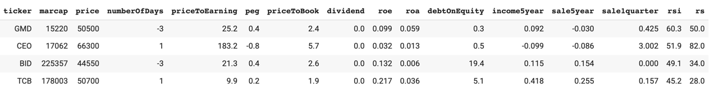

<div id="badges" align="center">


</div>

---

🌐 View in **[English](https://github.com/thinh-vu/vnstock/blob/main/README-en.md)**

MỤC LỤC
- [I. 🎤 Giới thiệu](#i--giới-thiệu)
- [II. 📚 Hướng dẫn sử dụng cho người mới](#ii--hướng-dẫn-sử-dụng-cho-người-mới)
- [III. 💻 Cách sử dụng các hàm trong vnstock](#iii--cách-sử-dụng-các-hàm-trong-vnstock)
- [IV. 🚚 Xuất, Lưu trữ, Chia sẻ dữ liệu](#iv-xuất-lưu-trữ-chia-sẻ-dữ-liệu)
- [V. 🙋‍♂️ Thông tin liên hệ](#v-️-thông-tin-liên-hệ)
- [VI. 💪 Hỗ trợ phát triển dự án vnstock](#vi--hỗ-trợ-phát-triển-dự-án-vnstock)
- [VII. ⚖ Tuyên bố miễn trừ trách nhiệm](#vii--tuyên-bố-miễn-trừ-trách-nhiệm)
- [VII. 🔑 Bản quyền và giấy phép](#vii-bản-quyền-và-giấy-phép)


# I. 🎤 Giới thiệu
## 1.1. Giới thiệu chung
vnstock là thư viện Python được thiết kế để tải dữ liệu chứng khoán Việt Nam một cách dễ dàng và miễn phí. vnstock sử dụng các nguồn cấp dữ liệu đáng tin cậy, bao gồm nhưng không giới hạn từ công ty chứng khoán và công ty phân tích thị trường tại Việt Nam. Gói thư viện được thiết kế dựa trên nguyên tắc về sự đơn giản và mã nguồn mở, hầu hết các hàm được viết dựa trên thư viện request và pandas có sẵn trên môi trường Google Colab do đó người dùng không cần cài đặt thêm các gói thư viện kèm theo.

## 1.2. Tính năng chính
vnstock cung cấp nhiều tính năng đa dạng như tải dữ liệu lịch sử giá, thông tin công ty niêm yết, thông tin thị trường cho tất cả các mã chứng khoán niêm yết.

## 1.3. Nguồn cấp dữ liệu
Thư viện python này kết nối tới các API công khai của các nguồn cấp dữ liệu để tải về để làm việc dưới dạng các DataFrame trong dự án Python. Việc truy xuất dữ liệu này là hoàn toàn **MIỄN PHÍ**.

## 1.4. Tips
- Theo dõi những cập nhật về thay đổi của vnstock bằng tính năng `Watch`. Hiện tại vnstock được cập nhật thường xuyên hàng tuần qua nhánh `beta`, vì vậy theo dõi repo này giúp bạn luôn nắm bắt được kịp thời những thay đổi mới nhất.
- Đánh dấu yêu thích repo `vnstock` bằng tính năng `Star`. Đây cũng là cách giúp vnstock có thể tiếp cận tới nhiều người quan tâm hơn.

<details>
  <summary> Minh họa tính năng Watch và Star </summary>
  


</details>

## 1.5. Đóng góp xây dựng mã nguồn vnstock
- Bạn có thể đóng góp xây dựng vnstock thông qua nhiều hình thức khác nhau, trong đó có việc xây dựng và cải tiến mã nguồn hoặc dịch tài liệu của dự án. 
- Để bắt đầu, bạn có thể `folk` nhánh `beta` của repo này về tài khoản của mình, sửa đổi mã nguồn và tạo `pull request` để yêu cầu cập nhật mã nguồn. Sau khi kiểm tra các thay đổi và phê duyệt, mã nguồn do bạn đóng góp sẽ được gộp vào vnstock.
- Lưu ý: Những thay đổi do bạn đóng góp sẽ được phát hành trong phiên bản tiếp theo của `vnstock` trên Pypi.org đồng thời với những cập nhật của tác giả trên nhánh `beta`.

## 1.6. Hoàn thành khảo sát về vnstock
> vnstock là một dự án tôi tâm huyết, đầu tư nhiều thời gian để phát triển giúp bản thân và cộng đồng tiếp cận nguồn dữ liệu chứng khoán miễn phí và đáng tin cậy.

Hoàn thành bản khảo sát: [Tại đây](https://forms.gle/zaJnbgUCjjL1GoTF6)
Để đảm bảo rằng vnstock phát triển theo hướng đáp ứng nhu cầu của bạn, tôi rất mong nhận được phản hồi từ bạn. Bạn là người dùng quan trọng của vnstock và ý kiến của bạn sẽ giúp chúng tôi xây dựng một kế hoạch phát triển vnstock một cách toàn diện.

## 1.7. Dịch vụ "code dạo", gây quỹ phát triển dự án

Ngoài ra, để gây quỹ phát triển dự án, tôi cũng cung cấp dịch vụ "code dạo" theo đặt hàng bao gồm nhưng không giới hạn với các hoạt động dưới đây:
- Tải dữ liệu thị trường
- Viết workflow quét dữ liệu, cập nhật cơ sở dữ liệu, vv
- Thiết lập dự án phân tích chứng khoán toàn diện
- Tạo bộ lọc cổ phiếu độc quyền
- Tạo robot giao dịch qua API
- Cung cấp API dữ liệu độc quyền

Nếu bạn nào quan tâm và có nhu cầu, vui lòng [inbox](https://www.messenger.com/t/mr.thinh.ueh) để trao đổi thêm. Hoạt động này cũng giúp tôi hiểu thêm về những ứng dụng thực tế và phát triển vnstock trong tương lai.

# II. 📚 Hướng dẫn sử dụng cho người mới
## 2.1. Tài nguyên quan trọng

### 2.1.2 Blog

👉 Để biết thêm thông tin và minh hoạ về cách sử dụng, bạn vui lòng truy cập bài viết trên blog của tôi, có sẵn bằng tiếng Việt/Anh [tại đây](https://thinhvu.com/2022/09/22/vnstock-api-tai-du-lieu-chung-khoan-python?utm_source=github&utm_medium=vnstock).

### 2.1.2 Notebook minh hoạ

👉 Bạn có thể mở tệp Jupyter Notebook [vnstock_demo_index_all_functions_testing](https://github.com/thinh-vu/vnstock/blob/beta/demo/gen2_vnstock_demo_index_all_functions_testing_2023_07_07.ipynb) để dùng thử tất cả các hàm của vnstock. Để sử dụng, nhấp vào nút  ở đầu trang của notebook để mở với Google Colab.

### 2.1.3. Docstring
Tất cả các hàm của vnstock đều được cung cấp docstring đầy đủ trong khi file README.md này có thể không cập nhật toàn bộ mô tả về các tham số cho phép của từng hàm. Bạn có thể xem phần gợi ý khi viết câu lệnh trên các IDE như Google Colab, Visual Studio Code, hay Jupyter Notebook hoặc mở phần source code của Github để xem chi tiết. Trong thời gian tới, vnstock sẽ được bổ sung mô tả đầy đủ tại README.md khi có thể.

<details>
  <summary>Docstring trên Google Colab</summary>
  Gợi ý cú pháp hàm được hiển thị khi viết bất kỳ hàm nào thuộc vnstock, trong ví dụ này hiển thị trong giao diện Google Colab.

  

</details>

<details>
  <summary>Docstring trong mã nguồn</summary>
  
  Mở mã nguồn tại file [vnstock.py](https://github.com/thinh-vu/vnstock/blob/beta/vnstock/stock.py), tìm hàm bạn cần tra cứu docstring.

  

</details>

### 2.1.4. Xây dựng cộng đồng vnstock

🖐 Nếu bạn thấy thư viện này có giá trị và muốn hỗ trợ tác giả duy trì vnstock dưới dạng mã nguồn mở, miễn phí thì có thể tham gia ủng hộ gây quỹ phát triển dự án này. Để biết thêm chi tiết, vui lòng tham khảo bài viết trên blog sau: [Cùng nhau xây dựng cộng đồng VNStock vững mạnh](https://thinhvu.com/2023/04/15/xay-dung-cong-dong-vnstock-vung-manh/).

- Tham gia nhóm vnstock trên Facebook: [Tại đây](https://www.facebook.com/groups/vnstock)
- Tham gia Discord channel: [Tại đây](https://discord.gg/qJvxJcChJ3)

<details>
  <summary>Ủng hộ quỹ phát triển vnstock</summary>
  Nếu vnstock giúp ích cho bạn, hãy đóng góp quỹ phát triển ứng dụng này theo một trong hai hình thức sau gồm chuyển khoản ngân hàng hoặc Momo. Mọi khoản đóng góp đều đáng trân quý và là động lực giúp tác giả duy trì vnstock luôn hữu ích, miễn phí, và dễ tiếp cận cho cộng đồng.

  - 
  - 

</details>

### 2.1.5. Lộ trình phát triển

🔥 Bạn có thể tham khảo thêm [Ý tưởng cho các tính năng nâng cao cho các phiên bản sắp tới](https://github.com/users/thinh-vu/projects/1/views/4) để đồng hành cùng vnstock. 

### 2.1.6. Lưu ý

👉 Từ phiên bản 0.1.3, tất cả các cập nhật về tính năng và nâng cấp cho thư viện được tổng hợp trong file [Lịch sử thay đổi](https://github.com/thinh-vu/vnstock/blob/beta/changes_log.md).

## 2.2 🛠 Cài đặt vnstock
### Bước 1. Chọn phiên bản phù hợp

> vnstock được phát triển thành hai nhánh riêng biệt. Bạn cần chọn phiên bản phù hợp và *copy câu lệnh tương ứng để thực hiện cài đặt ở bước tiếp theo*:

- Bản `stable` (đã phát triển ổn định) được chia sẻ qua pypi.org và nhánh `main` tại Github repo này. Để cài đặt bản stable bạn dùng câu lệnh đơn giản sau: 
`pip install vnstock` hoặc cài đặt trực tiếp từ Github với câu lệnh:

  `pip install git+https://github.com/thinh-vu/vnstock.git@main`

- Bản `beta` (nhận cập nhật mới nhất) được chia sẻ tại nhánh `beta` của Github repo.

  `pip install git+https://github.com/thinh-vu/vnstock.git@beta`

<details>
  <summary> Chọn xem nhánh phù hợp </summary>

  

</details>

### Bước 2. Chạy câu lệnh cài đặt

> Khi sử dụng file demo [vnstock_demo_index_all_functions_testing_2023_06_22.ipynb](https://github.com/thinh-vu/vnstock/blob/beta/demo/gen2_vnstock_demo_index_all_functions_testing_2023_07_07.ipynb) để bắt đầu, các câu lệnh cài đặt cần thiết đã được cung cấp sẵn để bạn thực thi (run).

**pip được sử dụng để cài đặt vnstock**. pip có sẵn trong hầu hết các bản phân phối Python được cài đặt. Phiên bản python cần thiết cho vnstock tối thiểu là 3.7. Bạn có thể paste câu lệnh đã copy ở Bước 1 và chạy nó trong môi trường Python bạn đang sử dụng.

- CLI: Mở Terminal (macOS/Linux) hoặc Command Prompt (Windows Desktop) và paste dòng lệnh trên, bấm Enter để cài đặt.pad
---

# III. 💻 Cách sử dụng các hàm trong vnstock

Bạn sẽ nắm được cách sử dụng các hàm của vnstock thông qua tài liệu hướng dẫn này, hoặc mở file demo [vnstock demo index](https://github.com/thinh-vu/vnstock/blob/beta/demo/gen2_vnstock_demo_index_all_functions_testing_2023_07_07.ipynb) để chạy các dòng lệnh mẫu, làm quen và xem kết quả trực tiếp.

Để nạp các hàm của vnstock vào dự án Python của bạn, cần `import` chúng thông qua câu lệnh như dưới đây. Như vậy mọi thứ đã sẵn sàng để truy cập dữ liệu do vnstock cung cấp thông qua các hàm được liệt kê trong tài liệu hướng dẫn.

```python
from vnstock import *
```

## 3.1. Danh sách cổ phiếu niêm yết (Listing)

### 3.1.1. 📰 Danh sách các công ty niêm yết
```python
listing_companies()
```
Hàm này đọc dữ liệu từ tệp csv đính kèm trên Github theo mặc định (trong thư mục /data của repo này). Bởi danh sách các công ty niêm yết thường không thay đổi liên tục nên việc này không gây trở ngại nhiều.

<details>
  <summary>Output</summary>

```
>>> listing_companies()
  ticker comGroupCode                                       organName                  organShortName organTypeCode comTypeCode  ... VNHEAL  VNIND   VNIT  VNMAT VNREAL  VNUTI
0    VVS   UpcomIndex  Công ty Cổ phần Đầu tư Phát triển Máy Việt Nam  Đầu tư Phát triển Máy Việt Nam            DN          CT  ...  False  False  False  False  False  False
1    XDC   UpcomIndex   Công ty TNHH MTV Xây dựng Công trình Tân Cảng    Xây dựng Công trình Tân Cảng            DN          CT  ...  False  False  False  False  False  False
2    HSV   UpcomIndex           Công ty Cổ phần Tập đoàn HSV Việt Nam                Gang Thép Hà Nội            DN          CT  ...  False  False  False  False  False  False
```

</details>

## 3.2. Phân tích cơ bản (Fundamental Analysis)

### 3.2.1. Thông tin tổng quan công ty

```python
company_overview('TCB')
```

<details>
  <summary>Output</summary>

  ```
  >>> company_overview('TCB')
    exchange    shortName  industryID industryIDv2   industry  ... deltaInMonth deltaInYear  outstandingShare  issueShare  ticker
  0     HOSE  Techcombank         289         8355  Ngân hàng  ...       -0.027      -0.038            3510.9      3510.9     TCB
  ```

</details>

### 3.2.2. 🧧 Lịch sử chi trả cổ tức

```python
dividend_history("VNM")
```

<details>
  <summary>Output</summary>

```
   exerciseDate  cashYear  cashDividendPercentage issueMethod
0      10/01/22      2021                    0.14        cash
1      07/09/21      2021                    0.15        cash
2      07/06/21      2020                    0.11        cash
3      05/01/21      2020                    0.10        cash
```
</details>

## 3.3. 💰 Phân tích tài chính (Financial Analysis)

### 3.3.1. Bộ chỉ số tài chính
```python
financial_ratio(symbol="TCB", report_range='yearly', is_all=False)
```
Trong đó:
- `report_range` nhận 1 trong 2 giá trị: `yearly` cho phép trả về chỉ số theo năm, `quarterly` trả về dữ liệu theo quý
- `is_all` có giá trị mặc định là `True` cho phép lấy chỉ số qua tất cả các kỳ (năm hoặc quý), `False` cho phép lấy các kỳ gần nhất (5 năm hoặc 10 quý gần đây).

<details>
  <summary>Output</summary>

  ```
>>> financial_ratio('TCB', 'yearly')
year                      2022   2021   2020   2019   2018
ticker                     TCB    TCB    TCB    TCB    TCB
priceToEarning             4.5    9.7    9.0    8.2   10.7
priceToBook                0.8    1.9    1.5    1.3    1.8
roe                      0.197  0.217  0.181  0.178  0.215
roa                      0.032  0.036   0.03  0.029  0.029
earningPerShare           5729   5132   3504   2869   2410
bookValuePerShare        32248  26452  21214  17679  14749
interestMargin           0.053  0.057  0.049  0.043  0.041
nonInterestOnToi         0.259   0.28  0.307  0.323  0.379
badDebtPercentage        0.007  0.007  0.005  0.013  0.018
provisionOnBadDebt       1.573  1.629   1.71  0.948  0.851
costOfFinancing          0.028  0.022  0.031  0.038  0.041
equityOnTotalAsset       0.162  0.164   0.17  0.162  0.161
equityOnLoan              0.27  0.268  0.269  0.269  0.324
costToIncome             0.328  0.301  0.319  0.347  0.318
equityOnLiability          0.2    0.2    0.2    0.2    0.2
epsChange                0.116  0.465  0.221  0.191  0.313
assetOnEquity              6.2    6.1    5.9    6.2    6.2
preProvisionOnToi        0.537  0.554  0.542   0.52  0.542
postTaxOnToi               0.5  0.497  0.465  0.485  0.462
loanOnEarnAsset          0.684  0.665  0.681  0.649  0.537
loanOnAsset              0.602  0.611  0.631  0.602  0.498
loanOnDeposit            1.173  1.104    1.0  0.998  0.794
depositOnEarnAsset       0.583  0.603   0.68  0.651  0.676
badDebtOnAsset           0.004  0.004  0.003  0.008  0.009
liquidityOnLiability     0.347  0.382  0.372  0.411  0.531
payableOnEquity            5.2    5.1    4.9    5.2    5.2
cancelDebt               0.002  0.004  0.013  0.002  0.008
bookValuePerShareChange  0.219  0.247    0.2  0.199  0.923
creditGrowth             0.211  0.252  0.202  0.443 -0.006
  ```
</details>


### 3.3.2. 💵 Báo cáo kết quả kinh doanh, cân đối kế toán và lưu chuyển tiền tệ

#### 3.3.2.1. 📄 Báo cáo kinh doanh


```python
financial_flow(symbol="TCB", report_type='incomestatement', report_range='quarterly')
```


<details>
  <summary>Output</summary>

```
        ticker  revenue  yearRevenueGrowth  quarterRevenueGrowth costOfGoodSold grossProfit  ...  investProfit  serviceProfit  otherProfit  provisionExpense operationIncome  ebitda
index                                                                                        ...
2021-Q4    TCB     7245              0.328                 0.074           None        None  ...           279           2103          532              -627            6767    None
2021-Q3    TCB     6742              0.310                 0.023           None        None  ...           384           1497          156              -589            6151    None
2021-Q2    TCB     6588              0.674                 0.076           None        None  ...           717           1457          444              -598            6615    None
2021-Q1    TCB     6124              0.454                 0.122           None        None  ...           812           1325          671              -851            6369    None
```
</details>

#### 3.3.2.2. 🧾 Bảng cân đối kế toán


```python
financial_flow(symbol="TCB", report_type='balancesheet', report_range='quarterly')
```

<details>
  <summary>Output</summary>

```
        ticker shortAsset  cash shortInvest shortReceivable inventory longAsset  fixedAsset  ...  payableInterest  receivableInterest deposit otherDebt  fund  unDistributedIncome  minorShareHolderProfit  payable
index                                                                                        ...

2021-Q4    TCB       None  3579        None            None      None      None        7224  ...             3098                5808  314753     33680  9156                47469                     845   475756
2021-Q3    TCB       None  3303        None            None      None      None        7106  ...             3074                6224  316376     34003  6784                45261                     753   453251
2021-Q2    TCB       None  3554        None            None      None      None        6739  ...             2643                5736  289335     27678  6790                40924                     659   420403
2021-Q1    TCB       None  4273        None            None      None      None        4726  ...             2897                5664  287446     26035  6790                36213                     563   3837
```
</details>

#### 3.3.2.3. 💶 Báo cáo lưu chuyển tiền tệ

```python
financial_flow(symbol="TCB", report_type='cashflow', report_range='quarterly')
```

<details>
  <summary>Output</summary>

```
        ticker  investCost  fromInvest  fromFinancial  fromSale  freeCashFlow
index
2021-Q4    TCB        -280        -276              0     -9328             0
2021-Q3    TCB        -180        -179             60     17974             0
2021-Q2    TCB        -337        -282              0     11205             0
2021-Q1    TCB        -143        -143              0     -6954             0
```
</details>

## 3.4. Phân tích kỹ thuật (Technical Analysis)

### 3.4.1 📈 Truy xuất dữ liệu giá lịch sử

> Phiên bản API hiện tại cho phép truy cập giá lịch sử tối đa đến ngày 2012-03-20 đối với tất cả mã cổ phiếu. Nếu bạn có nhu cầu lấy lịch sử giá từ thời điểm thị trường chứng khoán bắt đầu hoạt động (REE là mã cổ phiếu có giao dịch sớm nhất thị trường vào 2000-07-31), hãy là một thành viên của [vnstock membership](https://www.facebook.com/groups/vnstock) để được hỗ trợ.

vnstock cho phép người dùng tải xuống dữ liệu lịch sử giao dịch của `mã cổ phiếu, chỉ số, hợp đồng phái sinh`.
- Dữ liệu `cổ phiếu` và `chỉ số` hỗ trợ 5 mức độ chi tiết theo khoảng thời gian bao gồm: 1 phút, 15 phút, 30 phút, 1 giờ, 1 ngày. 
- Dữ liệu `phái sinh` hỗ trợ 8 mức độ chi tiết theo khoảng thời gian bao gồm: 1 phút, 3 phút, 5 phút, 15 phút, 30 phút, 45 phút, 1 giờ, 1 ngày
- Trường dữ liệu `time` sẽ là giá trị ngày tháng `YYYY-mm-dd` nếu `resolution` nhập vào là `1D`, trong khi `resolution` là cấp độ phút và giờ sẽ cho thêm thông tin thời gian giờ/phút.
- Đơn vị giá OHLC được làm tròn, chỉ lấy phần nguyên. Đơn vị tính là VND.

Trong ví dụ dưới đây, dữ liệu giá được truy xuất theo cấp độ ngày.

```python
df =  stock_historical_data(symbol='GMD', 
                            start_date="2021-01-01", 
                            end_date='2022-02-25', resolution='1D', type='stock')
print(df)
```
- Mới: 
  - Giá trị mà tham số `resolution` có thể nhận là `1D` (mặc định, 1 ngày), '1' (1 phút), 3 (3 phút), 5 (5 phút), 15 (15 phút), 30 (30 phút), 45 (45 phút), '1H' (hàng giờ).
  - `type = 'stock'` cho phép lấy dữ liệu giá của mã cổ cổ phiếu, `type = 'index'` cho phép lấy dữ liệu giá của mã chỉ số, và `type='derivative` cho phép lấy dữ liệu phái sinh. Các mã được hỗ trợ bao gồm (nhưng không giới hạn): VNINDEX, VN30, HNX, HNX30, UPCOM, VNXALLSHARE, VN30F1M, VN30F2M, VN30F1Q, VN30F2Q

Bạn cũng có thể viết hàm theo dạng rút gọn như dưới đây, điều này đúng với tất cả các hàm, miễn là thông số được nhập vào đúng thứ tự:

  - Lấy dữ liệu lịch sử cổ phiếu
  ```python
  df = stock_historical_data("GMD", "2021-01-01", "2022-02-25", "1D", 'stock')
  print(df)
  ```
Và đây là kết quả

<details>
  <summary>Output</summary>

  ```{r, engine='python', count_lines}
   time        open     high     low      close    volume
0  2021-01-04  32182.0  33157.0  31987.0  32279.0  4226500
1  2021-01-05  32279.0  33596.0  31938.0  32962.0  4851900
2  2021-01-06  33352.0  33352.0  32279.0  32572.0  3641300
  ```

</details>

- Lấy dữ liệu lịch sử của mã chỉ số
```python
df = stock_historical_data("VNINDEX", "2021-01-01", "2022-02-25", "1D", 'index')
print(df)
```

- Lấy dữ liệu lịch sử của hợp đồng phái sinh
```python
df = stock_historical_data("VN30F1M", "2023-07-01", "2023-07-24", "1D", 'derivative')
print(df)
```

## 3.5. Lựa chọn cổ phiếu (Stock Screening)

### 3.5.1. So sánh các cổ phiếu tiềm năng

#### 3.5.1.1. 📊 Bảng giá (Price board)

Bạn có thể tải xuống bảng giá của một danh sách các cổ phiếu được chọn để phân tích, thiết lập thuật toán dễ dàng hơn (khi xuất ra Google Sheets/Excel) so với việc xem trực tiếp trên bảng giá của các công ty chứng khoán.

<details>
  <summary>Minh họa Bảng giá TCBS</summary>

  

</details>


##### a. Thông tin bước giá, khối lượng và khớp lệnh

```python
price_depth('TCB,SSI,VND')
```
Sử dụng hàm này cho phép thống kê các bước giá và khối lượng trên bảng giá của một hoặc một danh sách các mã cổ phiếu. Bạn có thể sử dụng kết hợp hàm này với hàm `price_board` để kết hợp các thông tin đa dạng về giá, khối lượng, chỉ số, thông tin giao dịch để chọn lọc và theo dõi cổ phiếu theo mục đích sử dụng của mình.

<details>
  <summary>Output</summary>

  >>> price_depth('TCB,SSI,VND')
  Mã CP  Giá tham chiếu  Giá Trần  Giá Sàn  Giá mua 3 KL mua 3  Giá mua 2 KL mua 2  Giá mua 1  ... KL bán 1  Giá bán 2  KL bán 2  Giá bán 3 KL bán 3  Tổng Khối Lượng ĐTNN Mua  ĐTNN Bán  ĐTNN Room
0   TCB           31950     34150    29750      31900       10      31850      130      31800  ...     9240      32000     19940      32049     7750           447200        0         0          0     
1   SSI           28400     30350    26450      28450      100      28400     9850      28350  ...    30640      28550     22730      28600    48410          1610280   142759     17353  803963854     
2   VND           17950     19200    16700      18450    11620      18400    38790      18350  ...    73180      18550     87830      18600   223700          4360710   152966      8355  932083910     

[3 rows x 22 columns]

</details>


##### b. Thông tin giao dịch bổ sung và các chỉ số

```
price_board('TCB,SSI,VND')
```
Hàm này cho phép tải về thông tin giá, khối lượng và các chỉ số quan trọng cho một hoặc một danh sách mã cổ phiếu. Sử dụng kết hợp với hàm `price_depth` cho hiệu quả tốt nhất.

<details>
  <summary>Output</summary>

```
>>> price_board('TCB,SSI,VND')
  Mã CP  Giá Khớp Lệnh  KLBD/TB5D  T.độ GD  KLGD ròng(CM)  ...  vnid1m  vnid3m  vnid1y  vnipe    vnipb
0   TCB        48600.0        0.6     0.49         -23200  ...    -3.7    -2.0    22.4  17.99  2.46159
1   SSI        43300.0        0.5     0.50        -112200  ...    -3.7    -2.0    22.4  17.99  2.46159
2   VND        32600.0        0.7     0.68          37300  ...    -3.7    -2.0    22.4  17.99  2.46159
```
</details>


#### 3.5.1.2. 🏭 Phân tích chỉ số các cổ phiếu cùng ngành (Industry Analysis)

```python
industry_analysis("VNM", lang='vi)
```
- Trả về thông tin các mã cổ phiếu cùng ngành với mã cổ phiếu nằm trong cùng nhóm ngành với mã `VNM`.
- Tham số `lang='vi` mặc định trả về tên các chỉ số bằng tiếng Việt, đổi thành `en` để giữ nguyên chỉ số với tên tiếng Anh.

- Trong đó các chỉ số sau được thể hiện dưới dạng thập phân sử dụng để thể hiện chỉ số dưới dạng %: 
  ```dividend (Cổ tức), ROE, ROA, ebitOnInterest (Thanh toán lãi vay), currentPayment (Thanh toán hiện hành), quickPayment (Thanh toán nhanh), grossProfitMargin (Biên LNG), postTaxMargin (Biên LNST), badDebtPercentage (Tỉ lệ nợ xấu), debtOnEquity (Nợ/Vốn CSH), debtOnEbitda (Nợ/EBITDA), income5year (LNST 5 năm),  sale5year (Doanh thu 5 năm), income1quarter (LNST quý gần nhất), sale1quarter (Doanh thu quý gần nhất), nextIncome (LNST năm tới), nextSale (Doanh thu quý tới)```
- Lưu ý: Tên các column có thể chưa được chuyển đổi đầy đủ thành tiếng Việt. Nếu gặp chỉ số nào chưa được chuyển đổi tên thành tiếng Việt, bạn vui lòng comment cho tác giả nhé.

<details>
  <summary>Output</summary>

```
>>> industry_analysis('VNM', label='vi')
Mã CP                          VNM     MSN    MCH    QNS    KDC     IDP    SBT    MML    PAN    MCM    VSF    VOC    OCH    VSN    CLX    LSS     KTC    HSL    HKB
Vốn hóa (tỷ)                  None  107634  51307  17543  16102   13204  11478  10108   4303   4232   3979   2890   1680   1618   1274    932     383    219     46
Giá                           None   75600  71603  49149  62600  224000  15500  30900  20600  38473   7958  23727   8400  19994  14713  12500   10500   6180    900
Số phiên tăng/giảm liên tiếp  None       3      2      4      0      -3      3      1     -1      1     -2      0      0      0      1      3       0     -1      0
P/E                            NaN    49.2    9.1   12.3 -215.9    16.7   16.6  -18.7   13.2   11.7 -384.1    2.4   15.2   11.9    7.1   23.5    37.3   14.6   -0.8
PEG                            NaN    -0.6   -8.0    0.9    1.9    -1.6   -1.4    0.1   -1.9    5.9    4.0    0.0   -0.1   -1.6    1.1    2.2    -0.8    0.8    0.5
P/B                            NaN     4.1    2.2    2.3    2.5     6.5    1.2    1.9    1.0    1.8    1.7    1.1    1.3    1.2    0.8    0.6     1.0    0.5    0.2
EV/EBITDA                      NaN    20.0    8.2   10.4   36.1    13.1   13.7 -267.0    7.2   11.4   25.9   -8.9    6.3    8.3   10.5    6.5    20.0   12.8   -3.1
Cổ tức                         NaN   0.009    0.0    0.0  0.086   0.033    0.0    0.0    0.0    0.0    0.0    0.0    0.0    0.0    0.0    0.0     0.0    0.0    0.0
ROE                            NaN   0.081  0.277  0.195 -0.011   0.442  0.076 -0.098  0.075  0.159 -0.005  0.591  0.086  0.107  0.118  0.025   0.025  0.036 -0.263
ROA                            NaN   0.016  0.175  0.128 -0.006    0.22  0.025 -0.042  0.021   0.14 -0.001  0.484  0.049  0.067  0.082  0.014   0.007  0.031  -0.15
Thanh toán lãi vay             NaN     0.5    9.1    8.5   -0.2    19.4    0.9   -0.8    1.3    NaN    0.3   -2.0   -3.2   67.7   22.1    2.2     0.9    6.9   -4.4
Thanh toán hiện hành           NaN     0.8    2.7    1.8    1.6     1.5    1.2    1.4    1.3    8.6    1.0    4.2    1.9    2.5    3.1    1.3     0.9    9.7    0.3
Thanh toán nhanh               NaN     0.6    2.5    1.4    1.2     1.3    0.9    1.1    0.9    7.7    0.4    3.4    1.7    1.7    2.9    0.3     0.5    8.6    0.3
Biên LNG                       NaN   0.272  0.432   0.28  0.188   0.385  0.115  0.117  0.171  0.323  0.067    NaN  0.286  0.247  0.264  0.121   0.035  0.039  0.728
Biên LNST                      NaN   0.011  0.228  0.149    NaN   0.138  0.026    NaN  0.016  0.138    NaN  6.467    NaN  0.039  0.372  0.017   0.004  0.024    NaN
Nợ/Vốn CSH                     NaN     2.0    0.3    0.4    0.6     0.4    1.3    1.0    0.7    0.0    1.5    0.1    0.1    0.0    0.0    0.4     2.3    0.0    0.5
Nợ/EBITDA                      NaN     7.6    1.1    1.5    8.1     0.7    7.2  -88.3    3.4    0.1   12.3   -1.1    0.7    1.1    0.4    2.6    15.5    0.8   -2.0
LNST 5 năm                     NaN   0.028  0.207  0.046  -0.04     NaN   0.12    NaN  0.001  0.098    NaN    NaN    NaN  0.012  0.065   -0.1  -0.157 -0.081    NaN
Doanh thu 5 năm                NaN   0.152  0.153  0.016  0.123     NaN   0.22 -0.239  0.274  0.049 -0.053 -0.181 -0.018 -0.002  0.088 -0.008   0.067   0.16 -0.474
LNST quý gần nhất              NaN  -0.519 -0.255 -0.258    NaN   0.316  0.443    NaN -0.694  0.397    NaN    NaN    NaN -0.131  0.092    NaN  36.983  -0.44    NaN
Doanh thu quý gần nhất         NaN  -0.094 -0.252  0.093 -0.302  -0.057 -0.181  0.031 -0.352 -0.067  -0.31 -0.675 -0.197 -0.134 -0.123  0.102  -0.122 -0.142  0.009
LNST năm tới                   NaN   0.285   0.26  0.173 -0.202   0.074  0.047 -0.719 -0.041   0.04 -0.939  0.116  6.025 -0.034   0.09 -0.155   0.813  0.022    NaN
Doanh thu năm tới              NaN     0.2    0.3  0.162  0.283     0.1    0.1   -0.7   0.05   0.05   0.03   0.15   -0.5    0.1    0.3  -0.08   -0.06   0.02    NaN
RSI                            NaN    50.7   43.1   71.8   24.0    28.5   59.2   33.7   68.2   53.5   46.6   44.1   51.1   32.3   55.5   55.3    33.3   54.8   61.1
```
</details>


#### 3.5.1.3. 🔬 So sánh các chỉ số của danh sách các cổ phiếu tùy chọn
```python
stock_ls_analysis("TCB, BID, CEO, GMD", lang='vi')
```

<details>
  <summary>Output</summary>



```
  ticker  marcap  price  numberOfDays  priceToEarning  peg  priceToBook  valueBeforeEbitda  dividend  ...  debtOnEbitda  income5year  sale5year income1quarter  sale1quarter  nextIncome  nextSale   rsi    rs
0    GMD   15220  50500            -3            25.2  0.4          2.4               16.2       0.0  ...           1.8        0.092     -0.030          0.500         0.425         NaN       NaN  60.3  50.0
1    CEO   17062  66300             1           183.2 -0.8          5.7               81.8       0.0  ...           7.8       -0.099     -0.086            NaN         3.002      -1.469      -0.2  51.9  82.0
2    BID  225357  44550            -3            21.3  0.4          2.6                NaN       0.0  ...           NaN        0.115      0.154          0.083         0.000         NaN       NaN  49.1  34.0
3    TCB  178003  50700             1             9.9  0.2          1.9                NaN       0.0  ...           NaN        0.418      0.255          0.059         0.157         NaN       NaN  45.2  28.0
```

</details>


#### 3.5.1.4. ⭐ Đánh giá xếp hạng 
##### a. Đánh giá chung


```python
general_rating("VNM")
```

<details>
  <summary>Output</summary>

```
   stockRating  valuation  financialHealth  businessModel  businessOperation  rsRating  taScore  ... ticker highestPrice  lowestPrice  priceChange3m  priceChange1y  beta   alpha
0          2.4        1.5              4.8            3.0                3.2       1.0      1.0  ...    VNM     102722.2      78600.0         -0.092         -0.232  0.49 -0.0014
```
</details>

##### b. 🌱 Đánh giá mô hình kinh doanh
```python
biz_model_rating("VNM")
```

<details>
  <summary>Output</summary>

```
  ticker  businessModel  businessEfficiency  assetQuality  cashFlowQuality  bom  businessAdministration  productService  businessAdvantage  companyPosition  industry  operationRisk
0    VNM            3.0                   3             3                3    3                       3               3                  3                3         3              3
```
</details>

##### c. 🎮 Đánh giá hiệu quả hoạt động
```python
biz_operation_rating("VNM")
```

<details>
  <summary>Output</summary>

```
      industryEn loanGrowth depositGrowth netInterestIncomeGrowth netInterestMargin  ... last5yearsFCFFGrowth lastYearGrossProfitMargin lastYearOperatingProfitMargin  lastYearNetProfitMargin  TOIGrowth
0  Food Products       None          None                    None              None  ...                    2                         5                             3                        4       None
```
</details>

##### d. 📑 Đánh giá sức khỏe tài chính
```python
financial_health_rating("VNM")
```

<details>
  <summary>Output</summary>

```
      industryEn loanDeposit badLoanGrossLoan badLoanAsset provisionBadLoan ticker  financialHealth  netDebtEquity  currentRatio  quickRatio  interestCoverage  netDebtEBITDA
0  Food Products        None             None         None             None    VNM              4.8              4             5           5                 5              5
```
</details>

##### e. 💲 Đánh giá về Định giá
```python
valuation_rating("VNM")
```

<details>
  <summary>Output</summary>

```
      industryEn ticker  valuation  pe  pb  ps  evebitda  dividendRate
0  Food Products    VNM        1.5   2   1   1         1             3
```
</details>

##### f. 💳 Sức khỏe tài chính theo ngành
```python
industry_financial_health("VNM")
```

<details>
  <summary>Output</summary>

```
  industryEn loanDeposit badLoanGrossLoan badLoanAsset provisionBadLoan ticker  financialHealth  netDebtEquity  currentRatio  quickRatio  interestCoverage  netDebtEBITDA
0       None        None             None         None             None    VNM              3.4              4             4           3                 3              3
```
</details>

### 3.5.2. 🔎 Bộ lọc cổ phiếu

Bộ lọc cổ phiếu là một hàm cho phép bạn truy vấn và lọc các cổ phiếu theo nhiều tiêu chí đa dạng dựa trên dữ liệu phân tích của TCBS. Hàm này sẽ trả về một DataFrame chứa các thông tin toàn diện về các cổ phiếu thỏa mãn điều kiện lọc của bạn. Bạn có thể dùng DataFrame này để tiếp tục phân tích, biểu diễn hoặc xuất ra dữ liệu dạng bảng tính. Đây là cập nhật ưu việt giúp bạn tiết kiệm thời gian và công sức đáng kể khi làm việc với dữ liệu cổ phiếu, đồng thời cho phép lập trình để lọc là cập nhật danh sách cổ phiếu hiệu quả không cần sử dụng giao diện web từ công ty chứng khoán.

<details>
  <summary> Bộ lọc cổ phiếu TCBS </summary>

  

</details>

Tham số
- params (dict): một từ điển chứa các tham số và giá trị của chúng cho việc lọc cổ phiếu. Các `key` là tên của các bộ lọc, và các `value` là một giá trị đơn hoặc một tupple gồm hai giá trị (min và max) cho bộ lọc đó. Đây là ví dụ cho tham số params được thiết lập đúng:

```python
params = {
            "exchangeName": "HOSE",
            "marketCap": (100, 1000),
            "pe": (10, 20),
            "dividendYield": (5, 10),
            "tcbsRecommend": "BUY",
            "size": 50
        }

# Áp dụng bộ lọc với hàm để lấy kết quả
stock_screening_insights (params)
```

<details>

<summary>Các bộ lọc gợi ý và tiêu chí hỗ trợ bao gồm</summary>

  a. BỘ LỌC GỢI Ý (PRESET)

    > Sử dụng các tiêu chí lọc như sau để thiết lập tham số params.

    - CANSLIM: epsGrowth1Year, lastQuarterProfitGrowth, roe, avgTradingValue20Day, relativeStrength1Month
    - Giá trị: roe, pe, avgTradingValue20Day
    - Cổ tức cao: dividendYield, avgTradingValue20Day
    - Phá nền mua: avgTradingValue20Day, forecastVolumeRatio, breakout: 'BULLISH'
    - Giá tăng + Đột biến khối lượng: avgTradingValue20Day, forecastVolumeRatio
    - Vượt đỉnh 52 tuần: avgTradingValue20Day, priceBreakOut52Week: 'BREAK_OUT'
    - Phá đáy 52 tuần: avgTradingValue20Day, priceWashOut52Week: 'WASH_OUT'
    - Uptrend ngắn hạn: avgTradingValue20Day, uptrend: 'buy-signal'
    - Vượt trội ngắn hạn: relativeStrength3Day, 
    - Tăng trưởng: epsGrowth1Year, roe, avgTradingValue20Day

  b. THÔNG TIN CHUNG

    - exchangeName: sàn giao dịch của cổ phiếu, ví dụ "HOSE", "HNX", hoặc "UPCOM". Bạn có thể dùng dấu phẩy để phân tách nhiều sàn, ví dụ "HOSE,HNX,UPCOM".
    - hasFinancialReport: Có báo cáo tài chính gần nhất. `1` nghĩa là có, `0` nghĩa là không.
    - industryName: Lọc các cổ phiếu theo ngành cụ thể. Giá trị dạng `Retail` cho ngành Bán lẻ. Các giá trị khác có thể là:
      - `Insurance`: Bảo hiểm
      - `Real Estate`: Bất động sản
      - `Technology`: Công nghệ thông tin
      - `Oil & Gas`: Dầu khí
      - `Financial Services`: Dịch vụ tài chính
      - `Utilities`: Điện, nước, xăng dầu và khí đốt
      - `Travel & Leisure`: Du lịch và giải trí
      - `Industrial Goods & Services`: Hàng và dịch vụ công nghiệp
      - `Personal & Household Goods`: Hàng cá nhân và gia dụng
      - `Chemicals`: Hóa chất
      - `Banks`: Ngân hàng
      - `Automobiles & Parts`: Ô tô và phụ tùng
      - `Basic Resources`: Tài nguyên cơ bản
      - `Food & Beverage`: Thực phẩm và đồ uống
      - `Media`: Truyền thông
      - `Telecommunications`: Viễn thông
      - `Construction & Materials`: Xây dựng và vật liệu
      - `Health Care`: Y tế
      - marketCap: vốn hóa thị trường của cổ phiếu tính bằng tỷ VND.
      - priceNearRealtime: giá hiện tại của cổ phiếu tính bằng VND.
      - foreignVolumePercent: tỷ lệ phần trăm khối lượng nước ngoài trong tổng khối lượng.
      - alpha: lợi nhuận vượt trội của cổ phiếu so với lợi nhuận thị trường.
      - beta: độ biến động của cổ phiếu so với thị trường.
      - freeTransferRate: tỷ lệ phần trăm cổ phiếu có thể chuyển nhượng tự do.
  
  c. TĂNG TRƯỞNG

    - revenueGrowth1Year: tốc độ tăng trưởng doanh thu trong năm qua.
    - revenueGrowth5Year: tốc độ tăng trưởng doanh thu trung bình trong 5 năm qua.
    - epsGrowth1Year: tốc độ tăng trưởng lợi nhuận trên mỗi cổ phiếu trong năm qua.
    - epsGrowth5Year: tốc độ tăng trưởng lợi nhuận trên mỗi cổ phiếu trung bình trong 5 năm qua.
    - lastQuarterRevenueGrowth: tốc độ tăng trưởng doanh thu trong quý gần nhất.
    - secondQuarterRevenueGrowth: tốc độ tăng trưởng doanh thu trong quý thứ hai.
    - lastQuarterProfitGrowth: tốc độ tăng trưởng lợi nhuận trong quý gần nhất.
    - secondQuarterProfitGrowth: tốc độ tăng trưởng lợi nhuận trong quý thứ hai.
  
  d. CHỈ SỐ TÀI CHÍNH
  
    - grossMargin: tỷ suất lợi nhuận gộp của cổ phiếu.
    - netMargin: tỷ suất lợi nhuận ròng của cổ phiếu.
    - roe: tỷ suất sinh lời về vốn chủ sở hữu của cổ phiếu.
    - doe: tỷ suất cổ tức về vốn chủ sở hữu của cổ phiếu.
    - dividendYield: tỷ suất cổ tức của cổ phiếu.
    - eps: lợi nhuận trên mỗi cổ phiếu của cổ phiếu tính bằng VND.
    - pe: tỷ số giá/lợi nhuận của cổ phiếu.
    - pb: tỷ số giá/giá trị sổ sách của cổ phiếu.
    - evEbitda: tỷ số giá trị doanh nghiệp/lợi nhuận trước thuế, lãi vay, khấu hao và amortization của cổ phiếu.
    - netCashPerMarketCap: tỷ số tiền mặt ròng/vốn hóa thị trường của cổ phiếu.
    - netCashPerTotalAssets: tỷ số tiền mặt ròng/tổng tài sản của cổ phiếu.
    - profitForTheLast4Quarters: tổng lợi nhuận trong 4 quý gần nhất của cổ phiếu tính bằng tỷ VND.
  
  e. BIẾN ĐỘNG GIÁ & KHỐI LƯỢNG

    - suddenlyHighVolumeMatching: tín hiệu chỉ ra nếu có sự tăng đột biến khối lượng khớp lệnh cho cổ phiếu này. 0 nghĩa là không, 1 nghĩa là có.
    - totalTradingValue: tổng giá trị giao dịch của cổ phiếu này tính bằng tỷ VND hôm nay.
    - avgTradingValue5Day: giá trị giao dịch trung bình của cổ phiếu này tính bằng tỷ VND trong 5 ngày.
    - avgTradingValue10Day: giá trị giao dịch trung bình của cổ phiếu này tính bằng tỷ VND trong 10 ngày.
    - avgTradingValue20Day: giá trị giao dịch trung bình của cổ phiếu này tính bằng tỷ VND trong 20 ngày.
    - priceGrowth1Week: tốc độ tăng trưởng giá của cổ phiếu trong tuần qua.
    - priceGrowth1Month: tốc độ tăng trưởng giá của cổ phiếu trong tháng qua.
    - percent1YearFromPeak: tỷ lệ phần trăm thay đổi của cổ phiếu từ giá cao nhất trong 1 năm.
    - percentAwayFromHistoricalPeak: tỷ lệ phần trăm thay đổi của cổ phiếu từ giá cao nhất lịch sử.
    - percent1YearFromBottom: tỷ lệ phần trăm thay đổi của cổ phiếu từ giá thấp nhất trong 1 năm.
    - percentOffHistoricalBottom: tỷ lệ phần trăm thay đổi của cổ phiếu từ giá thấp nhất lịch sử.
    - priceVsSMA5: mối quan hệ giữa giá hiện tại và SMA 5 ngày của cổ phiếu. Các giá trị có thể là "ABOVE", "BELOW", "CROSS_ABOVE", hoặc "CROSS_BELOW".
    - priceVsSma10: mối quan hệ giữa giá hiện tại và SMA 10 ngày của cổ phiếu. Các giá trị có thể là "ABOVE", "BELOW", "CROSS_ABOVE", hoặc "CROSS_BELOW".
    - priceVsSMA20: mối quan hệ giữa giá hiện tại và SMA 20 ngày của cổ phiếu. Các giá trị có thể là "ABOVE", "BELOW", "CROSS_ABOVE", hoặc "CROSS_BELOW".
    - priceVsSma50: mối quan hệ giữa giá hiện tại và SMA 50 ngày của cổ phiếu. Các giá trị có thể là "ABOVE", "BELOW", "CROSS_ABOVE", hoặc "CROSS_BELOW".
    - priceVsSMA100: mối quan hệ giữa giá hiện tại và SMA 100 ngày của cổ phiếu. Các giá trị có thể là "ABOVE", "BELOW", "CROSS_ABOVE", hoặc "CROSS_BELOW".
    - forecastVolumeRatio: tỷ số giữa khối lượng dự báo và khối lượng thực tế của cổ phiếu hôm nay.
    - volumeVsVSma5: tỷ số giữa khối lượng hiện tại và SMA khối lượng 5 ngày của cổ phiếu.
    - volumeVsVSma10: tỷ số giữa khối lượng hiện tại và SMA khối lượng 10 ngày của cổ phiếu.
    - volumeVsVSma20: tỷ số giữa khối lượng hiện tại và SMA khối lượng 20 ngày của cổ phiếu.
    - volumeVsVSma50: tỷ số giữa khối lượng hiện tại và SMA khối lượng 50 ngày của cổ phiếu.
  
  f. HÀNH VI THỊ TRƯỜNG

    - strongBuyPercentage: tỷ lệ phần trăm tín hiệu mua mạnh cho cổ phiếu này dựa trên phân tích kỹ thuật.
    - activeBuyPercentage: tỷ lệ phần trăm tín hiệu mua tích cực cho cổ phiếu này dựa trên phân tích kỹ thuật.
    - foreignTransaction: loại giao dịch nước ngoài cho cổ phiếu này hôm nay. Các giá trị có thể là "buyMoreThanSell", "sellMoreThanBuy", hoặc "noTransaction".
    - foreignBuySell20Session: giá trị mua bán ròng nước ngoài cho cổ phiếu này tính bằng tỷ VND trong 20 phiên.
    - numIncreaseContinuousDay: số ngày liên tiếp cổ phiếu này tăng giá.
    - numDecreaseContinuousDay: số ngày liên tiếp cổ phiếu này giảm giá.
  
  g. TÍN HIỆU KỸ THUẬT

    - rsi14: chỉ số sức mạnh tương đối (RSI) của cổ phiếu với chu kỳ 14 ngày.
    - rsi14Status: trạng thái của RSI cho cổ phiếu này. Các giá trị có thể là "intoOverBought", "intoOverSold", "outOfOverBought", hoặc "outOfOverSold".
    - tcbsBuySellSignal: tín hiệu mua bán cho cổ phiếu này dựa trên phân tích của TCBS. Các giá trị có thể là "BUY" hoặc "SELL".
    - priceBreakOut52Week: tín hiệu chỉ ra nếu có sự đột phá giá cho cổ phiếu này trong 52 tuần. Các giá trị có thể là "BREAK_OUT" hoặc "NO_BREAK_OUT".
    - priceWashOut52Week: tín hiệu chỉ ra nếu có sự rửa giá cho cổ phiếu này trong 52 tuần. Các giá trị có thể là "WASH_OUT" hoặc "NO_WASH_OUT".
    - macdHistogram: tín hiệu chỉ ra nếu có tín hiệu MACD histogram cho cổ phiếu này. Các giá trị có thể là "macdHistGT0Increase", "macdHistGT0Decrease", "macdHistLT0Increase", hoặc "macdHistLT0Decrease".
    - relativeStrength3Day: sức mạnh tương đối của cổ phiếu so với thị trường trong 3 ngày.
    - relativeStrength1Month: sức mạnh tương đối của cổ phiếu so với thị trường trong 1 tháng.
    - relativeStrength3Month: sức mạnh tương đối của cổ phiếu so với thị trường trong 3 tháng.
    - relativeStrength1Year: sức mạnh tương đối của cổ phiếu so với thị trường trong 1 năm.
    - tcRS: sức mạnh tương đối của TCBS của cổ phiếu so với thị trường.
    - sarVsMacdHist: tín hiệu chỉ ra nếu có tín hiệu SAR vs MACD histogram cho cổ phiếu này. Các giá trị có thể là "BUY" hoặc "SELL".
  
  h. TÍN HIỆU MUA/BÁN

    - bollingBandSignal: tín hiệu chỉ ra nếu có tín hiệu Bollinger Band cho cổ phiếu này. Các giá trị có thể là "BUY" hoặc "SELL".
    - dmiSignal: tín hiệu chỉ ra nếu có tín hiệu chỉ số chuyển động hướng (DMI) cho cổ phiếu này. Các giá trị có thể là "BUY" hoặc "SELL".
    - uptrend: tín hiệu chỉ ra nếu có tín hiệu xu hướng tăng cho cổ phiếu này. Các giá trị có thể là "buy-signal" hoặc "sell-signal".
    - breakout: tín hiệu chỉ ra nếu có tín hiệu đột phá cho cổ phiếu này. Các giá trị có thể là "BULLISH" hoặc "BEARISH".
  
  i. TCBS ĐÁNH GIÁ

    - tcbsRecommend: tín hiệu chỉ ra nếu có khuyến nghị của TCBS cho cổ phiếu này. Các giá trị có thể là "BUY" hoặc "SELL".
    - stockRating: điểm đánh giá cổ phiếu cho cổ phiếu này dựa trên phân tích của TCBS. Điểm từ 1 đến 5, với 5 là tốt nhất.
    - businessModel: điểm đánh giá mô hình kinh doanh cho cổ phiếu này dựa trên phân tích của TCBS. Điểm từ 1 đến 5, với 5 là tốt nhất.
    - businessOperation: điểm đánh giá hoạt động kinh doanh cho cổ phiếu này dựa trên phân tích của TCBS. Điểm từ 1 đến 5, với 5 là tốt nhất.
    - financialHealth: điểm đánh giá sức khỏe tài chính cho cổ phiếu này dựa trên phân tích của TCBS. Điểm từ 1 đến 5, với 5 là tốt nhất.

</details>


## 3.6. 🔥 Dữ liệu khớp lệnh trong ngày giao dịch

<details>
  <summary>Minh hoạ giao diện TCBS</summary>

  
  

</details>
vnstock cho phép người dùng tải xuống dữ liệu khớp lệnh trong ngày giao dịch theo thời gian thực. Nếu mốc thời gian bạn truy cứu rơi vào Thứ Bảy, Chủ Nhật thì dữ liệu nhận được thể hiện cho ngày giao dịch của Thứ 6 của tuần đó.

```python
df =  stock_intraday_data(symbol='TCB', 
                            page_size=500)
print(df)
```

<details>
  <summary>Terminal output</summary>

  ```{r, engine='python', count_lines}
>>> stock_intraday_data('TCB', 500)

  ticker      time  orderType investorType  volume  averagePrice  orderCount
0    TCB  14:29:55  Sell Down        SHEEP    1000       32700.0           1
1    TCB  14:29:47     Buy Up        SHEEP     200       32750.0           1
2    TCB  14:29:44  Sell Down         WOLF    8000       32700.0          14
3    TCB  14:29:41  Sell Down        SHEEP    1000       32700.0           5
4    TCB  14:29:36  Sell Down         WOLF   23800       32700.0          10
  ```

</details>

<details>
  <summary>Giải thích ý nghĩa chỉ số</summary>
  • Khi 1 lệnh lớn (từ Cá mập, tay to, tổ chức....) mua chủ động (hoặc bán chủ động) được đưa vào Sàn, thường thì nó sẽ được khớp với nhiều lệnh nhỏ đang chờ bán (hoặc chờ mua). Nếu chỉ nhìn realtime theo từng lệnh khớp riêng lẻ, thì sẽ không thể phát hiện được các lệnh to (của Cá mập, tay to...) vừa được đẩy vào Sàn. Vì vậy, chúng tôi "cộng dồn" các lệnh khớp này lại (phát sinh bởi 1 lệnh lớn chủ động vào sàn trong 1 khoảng thời gian rất nhanh) để giúp NĐT phát hiện các lệnh lớn (của Cá mập, tay to....) chính xác hơn. Lệnh Cá mập sẽ được tô xanh (cho Mua chủ động) và đỏ (cho Bán chủ động). 

  • Cá mập: (CM - SHARK) nhà đầu tư tay to, tổ chức, đầu tư lớn, dẫn dắt thị trường. Giá trị 1 lệnh đặt > 1 tỷ đồng/lệnh đặt. Đồ thị 1N dùng số liệu 1 phút cho 60’ gần nhất; 1W là tổng mỗi 15’ cho 1 tuần; 1M là tổng hàng ngày cho 1 tháng

  • Sói già: (SG - WOLF) nhà đầu tư kinh nghiệm, giá trị lệnh đặt cao. Giá trị 1 lệnh đặt từ 200 tr đến 1 tỷ đồng/lệnh đặt.

  • Cừu non: (CN - SHEEP) nhà đầu tư nhỏ lẻ, giá trị giao dịch và mua bán chủ động thấp. Giá trị 1 lệnh đặt Mua hoặc Bán chủ động < 200 triệu đồng/lệnh đặt vào.

  • Mua chủ động (hay Buy Up) là khi NĐT thực hiện chủ động mua lên qua việc đặt lệnh mua với giá bằng giá dư bán gần nhất để có thể khớp luôn. Như thế, giá khớp cho lệnh này thường sẽ đẩy giá khớp lên cao hơn thị giá trước đó.

  • Bán chủ động (hay Sell Down) là khi NĐT thực hiện chủ động Bán dưới giá hiện tại (hay thị giá) của cổ phiếu bằng việc đặt lệnh bán với giá bán bằng giá dư mua gần nhất để khớp ngay. Và như thế, thị giá sẽ bị kéo xuống thấp hơn so với thị giá trước đó. Thống kê khối lượng giao dich theo Mua CĐ và Bán CĐ dùng để đánh giá tương quan giữa cung (Bán CĐ) và cầu (Mua CĐ) trên giao dịch khớp lệnh thực tế, nhằm nhận định tương đối về sự vận động của xu hướng dòng tiền. Khi tỷ lệ % Mua CĐ trên (Tổng Mua và Bán CĐ) lớn hơn 50%, đồng nghĩa với việc thị trường đang có xu hướng mua vào nhiều hơn bán ra và ngược lại, qua đó xác định được dòng tiền vào/ra với mỗi cổ phiếu. Khi tỷ lệ này cao đột biến (>70% hay <30%) so với điểm cân bằng (50%) , đó là tín hiệu của việc mua hoặc bán bất chấp của thị trường.

</details>


## 3.7. 🌏 Thông tin thị trường

<details>
  <summary>Tạm ngưng hoạt động, chờ nâng cấp APIs</summary>

### 3.7.1. Các mã cổ phiếu đứng đầu theo tiêu chí xếp loại 

<details>
  <summary>SSI Top Stocks</summary>

Top Breakout (Đột phá) > Top Gainers (Tăng giá) > Top Losers (Giảm giá) > Top Value (Giá trị) > Top Volume (Khối lượng)


Top New High (vượt đỉnh) > Top Foreign Trading (nhà đầu tư ngước ngoài) > Top New Low (thủng đáy)


</details>

```python
market_top_mover('ForeignTrading')
```

<details>
  <summary>Output</summary>

```
    foreignBuyVolume  foreignBuyValue  ...                                          financial                                          technical
0          3826600.0     1.703888e+11  ...  {'organCode': 'DXG', 'rtd7': 14713.265320738, ...  {'organCode': 'DXG', 'sma20Past4': 34887.5, 's...
1          3270200.0     1.088892e+11  ...  {'organCode': 'STB', 'rtd7': 18173.6958318461,...  {'organCode': 'STB', 'sma20Past4': 34332.5, 's...
2          1456800.0     4.199166e+10  ...  {'organCode': 'FUEVFVND', 'rtd7': None, 'rtd11...  {'organCode': 'FUEVFVND', 'sma20Past4': 27993....
3          1033300.0     1.281170e+10  ...  {'organCode': 'FLC', 'rtd7': 12898.0038031343,...  {'organCode': 'FLC', 'sma20Past4': 12062.5, 's...
4           998600.0     5.324337e+10  ...  {'organCode': 'NLG', 'rtd7': 23318.1252311207,...  {'organCode': 'NLG', 'sma20Past4': 52385.0, 's...
```
</details>

### 3.7.2. Thông tin giao dịch nhà đầu tư nước ngoài (NDTNN)
Trong ví dụ dưới đây, thể hiện giao dịch mua vào của NDTNN.

```python
fr_trade_heatmap ('All', 'FrBuyVol')
```
<details>
  <summary>Output</summary>

  ```
    organCode  name      value  percentPriceChange  ...  ceilingPrice  floorPrice        industry_name      rate
  0        PVD   PVD  1433300.0            0.068627  ...       16350.0     14250.0              Dầu khí  0.040308
  1        PVS   PVS   370100.0            0.096154  ...       22800.0     18800.0              Dầu khí  0.040308
  2      PETRO   PLX   249700.0            0.014516  ...       33150.0     28850.0              Dầu khí  0.040308
  3   PETECHIM   PTV     4000.0            0.064000  ...        5400.0      4000.0              Dầu khí  0.040308
  4       BSRC   BSR     3800.0            0.002000  ...       17200.0     12800.0              Dầu khí  0.040308
  ..       ...   ...        ...                 ...  ...           ...         ...                  ...       ...
  10      None  Khác   210200.0            0.027762  ...           0.0         0.0            Ngân hàng  0.050653
  0        CMG   CMG    74400.0            0.024390  ...       43850.0     38150.0  Công nghệ Thông tin  0.034816
  1        SAM   SAM    35700.0            0.020833  ...        7700.0      6700.0  Công nghệ Thông tin  0.034816
  2        ELC   ELC     4100.0            0.049197  ...       10650.0      9270.0  Công nghệ Thông tin  0.034816
  3        ITD   ITD     2000.0            0.068548  ...       13250.0     11550.0  Công nghệ Thông tin  0.034816

  [92 rows x 10 columns]
  ```
</details>

### 3.7.3. Biến động của các nhóm chỉ số


Thông tin các nhóm chỉ số phổ biến của thị trường chứng khoán Việt Nam.

```python
get_latest_indices()
```

<details>
  <summary>Output</summary>

  ```
  >>> get_latest_indices()
    indexId comGroupCode  indexValue          tradingDate  ...  matchValue  ceiling  floor  marketStatus
0         0      VNINDEX     1108.08  2023-01-19T00:00:00  ...         0.0      0.0    0.0          None
1         0         VN30     1121.92  2023-01-19T00:00:00  ...         0.0      0.0    0.0          None
2         0     HNXIndex      219.87  2023-01-19T00:00:00  ...         0.0      0.0    0.0          None
3         0        HNX30      378.94  2023-01-19T00:00:00  ...         0.0      0.0    0.0          None
4         0   UpcomIndex       73.98  2023-01-19T00:00:00  ...         0.0      0.0    0.0          None
5         0       VNXALL     1707.39  2023-01-19T00:00:00  ...         0.0      0.0    0.0          None
6         0        VN100     1063.59  2023-01-19T00:00:00  ...         0.0      0.0    0.0          None
7         0        VNALL     1066.54  2023-01-19T00:00:00  ...         0.0      0.0    0.0          None
8         0       VNCOND     1537.34  2023-01-19T00:00:00  ...         0.0      0.0    0.0          None
9         0       VNCONS      793.25  2023-01-19T00:00:00  ...         0.0      0.0    0.0          None
10        0    VNDIAMOND     1689.15  2023-01-19T00:00:00  ...         0.0      0.0    0.0          None
11        0        VNENE      541.51  2023-01-19T00:00:00  ...         0.0      0.0    0.0          None
12        0        VNFIN     1252.54  2023-01-19T00:00:00  ...         0.0      0.0    0.0          None
13        0    VNFINLEAD     1631.16  2023-01-19T00:00:00  ...         0.0      0.0    0.0          None
14        0  VNFINSELECT     1676.21  2023-01-19T00:00:00  ...         0.0      0.0    0.0          None
15        0       VNHEAL     1552.19  2023-01-19T00:00:00  ...         0.0      0.0    0.0          None
16        0        VNIND      628.34  2023-01-19T00:00:00  ...         0.0      0.0    0.0          None
17        0         VNIT     2631.82  2023-01-19T00:00:00  ...         0.0      0.0    0.0          None
18        0        VNMAT     1534.50  2023-01-19T00:00:00  ...         0.0      0.0    0.0          None
19        0        VNMID     1394.75  2023-01-19T00:00:00  ...         0.0      0.0    0.0          None
20        0       VNREAL      981.94  2023-01-19T00:00:00  ...         0.0      0.0    0.0          None
21        0         VNSI     1715.37  2023-01-19T00:00:00  ...         0.0      0.0    0.0          None
22        0        VNSML     1140.40  2023-01-19T00:00:00  ...         0.0      0.0    0.0          None
23        0        VNUTI      874.84  2023-01-19T00:00:00  ...         0.0      0.0    0.0          None
24        0        VNX50     1805.33  2023-01-19T00:00:00  ...         0.0      0.0    0.0          None
  ```
</details>

### 3.7.4. Dữ liệu chuyên sâu theo nhóm chỉ số cụ thể


```python
get_index_series(index_code='VNINDEX', time_range='OneYear')
```
- Nhà cung cấp dữ liệu: SSI iBoard sử dụng dữ liệu từ FiinTrade.
- Sử dụng một trong các mã chỉ số sau để tra cứu:
  
  ```
  'VNINDEX', 'VN30', 'HNXIndex', 'HNX30', 'UpcomIndex', 'VNXALL',
  'VN100','VNALL', 'VNCOND', 'VNCONS','VNDIAMOND', 'VNENE', 'VNFIN',
  'VNFINLEAD', 'VNFINSELECT', 'VNHEAL', 'VNIND', 'VNIT', 'VNMAT', 'VNMID',
  'VNREAL', 'VNSI', 'VNSML', 'VNUTI', 'VNX50'
  ```
  Bạn có thể liệt kê toàn bộ các nhóm chỉ số với hàm `get_latest_indices()`.

- `time_range`: Sử dụng khung thời gian là một trong các giá trị sau
 ```
 'OneDay', 'OneWeek', 'OneMonth', 'ThreeMonth', 'SixMonths', 'YearToDate', 'OneYear', 'ThreeYears', 'FiveYears'
 ```
<details>
  <summary>Output</summary>

  ```
  >>> get_index_series(index_code='VNINDEX', time_range='OneYear')
      comGroupCode  indexValue          tradingDate  ...    matchValue  totalMatchVolume  totalMatchValue
  0        VNINDEX     1470.76  2022-01-27T00:00:00  ...  1.554536e+13       498256400.0     1.554536e+13
  1        VNINDEX     1478.96  2022-01-28T00:00:00  ...  1.913215e+13       634887600.0     1.913215e+13
  2        VNINDEX     1497.66  2022-02-07T00:00:00  ...  1.710999e+13       516533800.0     1.710999e+13
  3        VNINDEX     1500.99  2022-02-08T00:00:00  ...  2.106676e+13       660158600.0     2.106676e+13
  4        VNINDEX     1505.38  2022-02-09T00:00:00  ...  2.360041e+13       722161500.0     2.360041e+13
  ..           ...         ...                  ...  ...           ...               ...              ...
  241      VNINDEX     1060.17  2023-01-13T00:00:00  ...  7.884840e+12       459494342.0     7.884840e+12
  242      VNINDEX     1066.68  2023-01-16T00:00:00  ...  6.724499e+12       391079501.0     6.724499e+12
  243      VNINDEX     1088.29  2023-01-17T00:00:00  ...  1.016031e+13       566247477.0     1.016031e+13
  244      VNINDEX     1098.28  2023-01-18T00:00:00  ...  9.377296e+12       531786150.0     9.377296e+12
  245      VNINDEX     1108.08  2023-01-19T00:00:00  ...  1.054607e+13       556193050.0     1.054607e+13

  [246 rows x 14 columns]
  ```
</details>

</details>

## 3.8. 🛡 Thị trường Phái Sinh

### 3.8.1. Dữ liệu giá lịch sử

> Xem chi tiết mục [3.4.1 📈 Truy xuất dữ liệu giá lịch sử](#341--truy-xuất-dữ-liệu-giá-lịch-sử) cùng với thông tin giá chứng khoán cơ sở.

### 3.8.2. Dữ liệu khớp lệnh lịch sử

<details>

<summary>Minh họa bảng dữ liệu khớp lệnh Phái sinh - CK Rồng Việt </summary>


</details>

Để truy vấn dữ liệu từ hàm này, bạn cần có cookie người dùng (không cần đăng nhập) của chứng khoán Rồng Việt. Các bước thực hiện như sau:
  1. Truy cập `https://livedragon.vdsc.com.vn/all/all.rv`
  2. Mở `Developer Tools` trên trình duyệt, sử dụng F12 hoặc `Ctrl` + `Shift` + `I` trên Windows hoặc `Cmd` + `Option` + `I` trên macOS
  3. Chuyển đến tab `Network` và chọn mục `Fetch/XHR`
  4. Mở bất kỳ mục request nào trong tab này, tìm mục `Header` của request
  5. Tìm và copy giá trị của `Cookie` trong request này để điền vào bước tiếp theo dưới đây trước khi gọi hàm

```python
cookie = 'GIÁ TRỊ COOKIE CẦN PASTE VÀO ĐÂY'
derivatives_historical_match (symbol='VN30F2308', date='2023-07-24', cookie=cookie)
```

# IV. 🚚 Xuất, Lưu trữ, Chia sẻ dữ liệu

> Để xuất, lưu trữ và chia sẻ dữ liệu với vnstock, bạn có rất nhiều sự lựa chọn kể cả sử dụng cơ sở dữ liệu, bảng tính (Excel, Google Sheets) và nhiều hình thức khác. Dữ liệu tiêu chuẩn tạo ra bởi vnstock là các pandas DataFrame do đó bạn có thể biến đổi và lưu trữ/chia sẻ dữ liệu dễ dàng với cách thức tiêu chuẩn của python. Dưới đây là hướng dẫn cơ bản với cách thức xuất dữ liệu ra csv và Google Sheets.

## 4.1. Xuất dữ liệu ra csv

Dành cho những bạn mới làm quen Python và Pandas có thể sử dụng dữ liệu từ vnstock dễ dàng với công cụ bảng tính quen thuộc. Bạn có thể xuất dữ liệu từ hàm bất kỳ ra csv và mở bằng Excel hoặc upload lên Google Drive và mở bằng Google Sheets.

```python
start_date = '2023-06-01'
end_date = '2023-07-24'
# Truy xuất dữ liệu
df = stock_historical_data('TCB', start_date, end_date)
# Xuất dữ liệu ra csv, chèn ngày tháng và mã CP
df.to_csv(f'THƯ-MỤC-CỦA-BẠN/TCB_historical_price_{start_date}_{end_date}.csv', index=True)
```

## 4.2. Xuất dữ liệu ra Google Sheets

Phương thức này được thiết kế riêng để xuất dữ liệu trực tiếp từ Google Colab sang Google Sheets (sẽ không hoạt động nếu chạy ở môi trường local, không thiết lập môi trường tương đồng Colab). Tham khảo cách làm chi tiết trong file demo, mục `III. Data Export`


# V. 🙋‍♂️ Thông tin liên hệ

Bạn có thể kết nối với tác giả qua các hình thức sau. Trong trường hợp cần hỗ trợ nhanh, bạn có thể chọn nhắn tin qua Messenger hoặc Linkedin, tôi sẽ phản hồi ngay lập tức nếu có thể trong hầu hết các trường hợp.

<div id="badges" align="center">
  <a href="https://www.linkedin.com/in/thinh-vu">
    
  </a>
  <a href="https://www.messenger.com/t/mr.thinh.ueh">
    
  <a href="https://www.youtube.com/channel/UCYgG-bmk92OhYsP20TS0MbQ">
    
  </a>
  </a>
    <a href="https://github.com/thinh-vu">
    
  </a>
</div>

# VI. 💪 Hỗ trợ phát triển dự án vnstock

Nếu bạn nhận thấy giá trị từ vnstock và các dự án mã nguồn mở của tôi, bạn có thể hỗ trợ phát triển chúng bằng cách quyên góp hoặc đơn giản là gửi tặng tôi một ly cà phê để cảm ơn.
Bạn có thể chọn 1 trong 3 hình thức đóng góp bao gồm Momo, Chuyển khoản ngân hàng và Gửi tiền qua Paypal. Sự đóng góp của bạn sẽ giúp tôi duy trì phí lưu trữ blog và tiếp tục tạo ra nội dung chất lượng cao. Cảm ơn sự ủng hộ của bạn!

- [Paypal](https://paypal.me/thinhvuphoto?country.x=VN&locale.x=en_US)

- 
  
- 

# VII. ⚖ Tuyên bố miễn trừ trách nhiệm
vnstock được phát triển nhằm mục đích cung cấp các công cụ nghiên cứu đơn giản và miễn phí, nhằm giúp người nghiên cứu tiếp cận và phân tích dữ liệu chứng khoán một cách dễ dàng. Dữ liệu được cung cấp phụ thuộc vào nguồn cấp dữ liệu, do đó, khi sử dụng, bạn cần thận trọng và cân nhắc.

💰 Trong bất kỳ trường hợp nào, người sử dụng hoàn toàn chịu trách nhiệm về quyết định sử dụng dữ liệu trích xuất từ vnstock và chịu trách nhiệm với bất kỳ tổn thất nào có thể phát sinh. Bạn nên tự mình đảm bảo tính chính xác và đáng tin cậy của dữ liệu trước khi sử dụng chúng.

Việc sử dụng dữ liệu chứng khoán và quyết định đầu tư là hoạt động có rủi ro và có thể gây mất mát tài sản. Bạn nên tìm kiếm lời khuyên từ các chuyên gia tài chính và tuân thủ các quy định pháp luật về chứng khoán tại Việt Nam và quốc tế khi tham gia vào hoạt động giao dịch chứng khoán.

Xin lưu ý rằng vnstock không chịu trách nhiệm và không có bất kỳ trách nhiệm pháp lý nào đối với bất kỳ tổn thất hoặc thiệt hại nào phát sinh từ việc sử dụng gói phần mềm này.

🐱‍👤 vnstock được thiết kế hoàn toàn cho mục đích phân tích và thực hành nghiên cứu đầu tư. Mọi hình thức sử dụng không đúng mục đích hoặc việc sử dụng trái phép thư viện với mục đích xấu như tấn công public API hay gây hại cho hệ thống thông qua từ chối truy cập hoặc các hành động tương tự, hoàn toàn nằm ngoài phạm vi sử dụng dự định và không thuộc trách nhiệm của nhóm phát triển.

# VII. 🔑 Bản quyền và giấy phép


```
Bản quyền (c) 2022 Thinh Vu | thinh-vu @ Github | MIT

Được cấp phép theo quyền tự do, miễn phí, cho bất kỳ cá nhân nào nhận được một bản sao của phần mềm này và các tệp tài liệu liên quan (gọi chung là "Phần mềm"), để sử dụng Phần mềm mà không có bất kỳ hạn chế nào, bao gồm nhưng không giới hạn quyền sử dụng, sao chép, sửa đổi, hợp nhất, xuất bản, phân phối, cấp phép lại và/hoặc bán các bản sao của Phần mềm, và cho phép những người nhận Phần mềm được nhúng vào Phần mềm này, tuân thủ các điều kiện sau đây:

Thông báo bản quyền trên và thông báo giấy phép này phải được bao gồm trong tất cả các bản sao hoặc phần quan trọng của Phần mềm.

PHẦN MỀM ĐƯỢC CUNG CẤP "NHƯ NÓ LÀ", KHÔNG BẢO ĐẢM BẤT KỲ LOẠI NÀO, BAO GỒM NHƯNG KHÔNG GIỚI HẠN ĐẾN SỰ BẢO ĐẢM VỀ CHẤT LƯỢNG KINH DOANH, PHÙ HỢP VỚI MỤC ĐÍCH CỤ THỂ VÀ VI PHẠM QUYỀN SỞ HỮU. TRONG MỌI TRƯỜNG HỢP, TÁC GIẢ HOẶC CHỦ SỞ HỮU BẢN QUYỀN KHÔNG CHỊU TRÁCH NHIỆM ĐỐI VỚI BẤT KỲ YÊU CẦU BỒI THƯỜNG, THIỆT HẠI HOẶC TRÁCH NHIỆM PHÁP LÝ NÀO PHÁT SINH TỪ HOẶC LIÊN QUAN ĐẾN SỬ DỤNG HOẶC HIỆN HỮU CỦA PHẦN MỀM.
```
