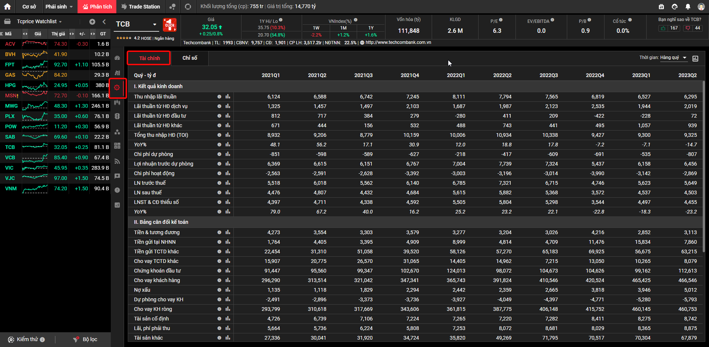

# Báo cáo tài chính

!!! tip "Lưu ý"
    Để tiện theo dõi và tra cứu, trong một số trường hợp chúng tôi sẽ xoay DataFrame trả về từ hàm với với phép `transpose` để thấy đầy đủ thông tin dễ hơn. Với các câu lệnh có phần kết thúc với `.T` tức là đang áp dụng phép `transpose` này.

## Dữ liệu từ SSI

!!! success "Cập nhật"
    26/10/2023, Hiện tại SSI đã gỡ bỏ mọi biện pháp ngăn chặn truy cập dữ liệu qua Web Scraping đã triển khai trong khoảng 6 tháng trước. Đây là tin vui cho cộng đồng vnstock vì các bạn có thêm lựa chọn chất lượng tiếp cận nguồn dữ liệu từ SSI được cung cấp bởi FiinTrade.


Để truy cập báo cáo tài chính sử dụng nguồn SSI, có độ chi tiết hơn so với bản rút gọn của TCBS, bạn sử dụng hàm `financial_report` với các tham số như sau:

- `symbol` là mã chứng khoán bạn muốn phân tích
- `report_type` nhận 1 trong 3 giá trị: `IncomeStatement` cho phép trả về báo cáo kết quả kinh doanh, `BalanceSheet` trả về báo cáo cân đối kế toán, `CashFlow` trả về báo cáo lưu chuyển tiền tệ
- `frequency` nhận 1 trong 2 giá trị: `Quarterly` cho phép trả về báo cáo theo quý, `Yearly` trả về dữ liệu theo năm

Lưu ý: Dữ liệu  trả về có đơn vị Tỷ VND

### Báo cáo kinh doanh

```python
financial_report (symbol='SSI', report_type='IncomeStatement', frequency='Quarterly')
```

Kết quả trả về nha sau:
    
```shell
>>> financial_report (symbol='SSI', report_type='IncomeStatement', frequency='Quarterly')
                                             CHỈ TIÊU       Q2 2021  ...       Q2 2023       Q3 2023
0                                 Doanh thu hoạt động  1.766190e+12  ...  1.679982e+12  1.941239e+12
1   Lãi từ các tài sản tài chính ghi nhận thông qu...  5.945796e+11  ...  7.074174e+11  7.646041e+11
2                       Lãi bán các tài sản tài chính  3.597305e+11  ...  2.414507e+11  2.494068e+11
3   Chêch lệch tăng đánh giá lại các tài sản tài c...  9.998599e+10  ...  3.001238e+10  7.229216e+10
4   Cổ tức, tiền lãi phát sinh từ tài sản tài chín...  1.348630e+11  ...  4.359542e+11  4.429051e+11
..                                                ...           ...  ...           ...           ...
78          Thu nhập toàn diện phân bổ cho chủ sở hữu  5.908075e+11  ...  5.690949e+11  7.021931e+11
79  Thu nhập toàn diện phân bổ cho cổ đông không k...  0.000000e+00  ...  0.000000e+00  0.000000e+00
80             Thu nhập thuần trên cổ phiếu phổ thông  0.000000e+00  ...  0.000000e+00  0.000000e+00
81                          Lãi cơ bản trên cổ phiếu   0.000000e+00  ...  0.000000e+00  0.000000e+00
82                   Thu nhập pha loãng trên cổ phiếu  0.000000e+00  ...  0.000000e+00  0.000000e+00

[83 rows x 11 columns]
```

### Bảng cân đối kế toán

```python
financial_report (symbol='SSI', report_type='BalanceSheet', frequency='Quarterly')
```

Kết quả trả về như sau:

```shell
>>> financial_report (symbol='SSI', report_type='BalanceSheet', frequency='Quarterly')
                                      CHỈ TIÊU       Q2 2021       Q3 2021  ...       Q1 2023       Q2 2023       Q3 2023
0                            TỔNG CỘNG TÀI SẢN  4.190985e+13  4.760360e+13  ...  5.270890e+13  5.013608e+13  5.528245e+13
1                             TÀI SẢN NGẮN HẠN  3.767755e+13  4.131681e+13  ...  4.918462e+13  4.662242e+13  5.184164e+13
2                   Tài sản tài chính ngắn hạn  3.761463e+13  4.123722e+13  ...  4.904718e+13  4.648384e+13  5.171536e+13
3                    Tiền và tương đương tiền   2.433256e+11  2.898345e+11  ...  1.425135e+11  1.553829e+11  4.109663e+11
4                                         Tiền  1.942694e+11  2.678036e+11  ...  1.386841e+11  1.472953e+11  1.820621e+11
..                                         ...           ...           ...  ...           ...           ...           ...
155                   Vốn ngân sách nhà nước    0.000000e+00  0.000000e+00  ...  0.000000e+00  0.000000e+00  0.000000e+00
156          Nguồn kinh phí đã hình thành TSCĐ  0.000000e+00  0.000000e+00  ...  0.000000e+00  0.000000e+00  0.000000e+00
157  LỢI ÍCH CỦA CỔ ĐÔNG THIỂU SỐ (trước 2015)  0.000000e+00  0.000000e+00  ...  0.000000e+00  0.000000e+00  0.000000e+00
158                        TỔNG CỘNG NGUỒN VỐN  4.190985e+13  4.760360e+13  ...  5.270890e+13  5.013608e+13  5.528245e+13
159      LỢI NHUẬN ĐÃ PHÂN PHỐI CHO NHÀ ĐẦU TƯ  0.000000e+00  0.000000e+00  ...  0.000000e+00  0.000000e+00  0.000000e+00

[160 rows x 11 columns]
```

### Báo cáo lưu chuyển tiền tệ

```python
financial_report (symbol='SSI', report_type='CashFlow', frequency='Quarterly')
```

Kết quả trả về như sau:

```shell
>>> financial_report (symbol='SSI', report_type='CashFlow', frequency='Quarterly')
                                             CHỈ TIÊU       Q2 2021  ...       Q2 2023       Q3 2023
0   Lưu chuyển thuần từ hoạt động kinh doanh chứng... -4.371889e+12  ...  3.570369e+12 -4.136934e+12
1   Lợi nhuận từ hoạt động kinh doanh trước thay đ...  3.506681e+11  ...  2.855112e+11  3.169111e+11
2                                Lợi nhuận trước thuế  7.334780e+11  ...  7.065172e+11  8.803150e+11
3                            Điều chỉnh cho các khoản -3.688521e+11  ... -4.205791e+11 -5.597634e+11
4                            Khấu hao tài sản cố định  1.454978e+10  ...  2.566442e+10  2.346254e+10
..                                                ...           ...  ...           ...           ...
93          Tiền và các khoản tương đương tiền đầu kỳ  2.792879e+11  ...  1.425135e+11  1.553829e+11
94                Tiền mặt, tiền gửi ngân hàng đầu kỳ  2.253831e+11  ...  1.389411e+11  1.471383e+11
95                         Các khoản tương đương tiền  5.416740e+10  ...  3.829481e+09  8.087528e+09
96  Ảnh hưởng của thay đổi tỷ giá hối đoán quy đổi... -2.626010e+08  ... -2.570934e+08  1.570900e+08
97        Tiền và các khoảng tương đương tiền cuối kỳ  2.433256e+11  ...  1.553829e+11  4.109663e+11

[98 rows x 11 columns]
```


## Dữ liệu từ TCBS



Ba loại báo cáo này được truy xuất từ nguồn TCBS thông qua hàm `financial_flow`. Hàm này nhận 3 tham số:

- `symbol` là mã chứng khoán bạn muốn phân tích
- `report_type` nhận 1 trong 3 giá trị: `incomestatement` cho phép trả về báo cáo kết quả kinh doanh, `balancesheet` trả về báo cáo cân đối kế toán, `cashflow` trả về báo cáo lưu chuyển tiền tệ
- `report_range` nhận 1 trong 2 giá trị: `yearly` cho phép trả về báo cáo theo năm, `quarterly` trả về dữ liệu theo quý

Cụ thể từng báo cáo được minh họa chi tiết thành từng phần như dưới đây.

### Báo cáo kinh doanh


Báo cáo kết quả kinh doanh có thể được truy xuất bằng câu lệnh:

```
income_df = financial_flow(symbol="TCB", report_type='incomestatement', report_range='quarterly')
```

Kết quả trả về như dưới đây. 

```shell
>>> financial_flow(symbol="TCB", report_type='incomestatement', report_range='quarterly').T

index                          2023-Q2 2023-Q1 2022-Q4 2022-Q3 2022-Q2  ... 2012-Q4 2012-Q3 2012-Q2 2012-Q1 2010-Q2
ticker                             TCB     TCB     TCB     TCB     TCB  ...     TCB     TCB     TCB     TCB     TCB
revenue                           6295    6527    6819    7565    7794  ...     951    1414    1432    1318     814
yearRevenueGrowth               -0.192  -0.195  -0.059   0.122   0.183  ...     NaN     NaN     NaN     NaN     NaN
quarterRevenueGrowth            -0.036  -0.043  -0.099  -0.029  -0.039  ...  -0.327  -0.013   0.086     NaN     NaN
costOfGoodSold                    None    None    None    None    None  ...    None    None    None    None    None
grossProfit                       None    None    None    None    None  ...    None    None    None    None    None
operationExpense                 -2869   -3142   -3990   -3014   -3196  ...   -1263    -615    -574    -826    -446
operationProfit                   9325    9300    9427   10338   10934  ...    1175    1373    1347    1851     972
yearOperationProfitGrowth       -0.147  -0.071  -0.072   0.178   0.188  ...     NaN     NaN     NaN     NaN     NaN
quarterOperationProfitGrowth     0.003  -0.014  -0.088  -0.055   0.093  ...  -0.144   0.019  -0.272     NaN     NaN
interestExpense                   None    None    None    None    None  ...    None    None    None    None    None
preTaxProfit                      5649    5623    4746    6715    7321  ...   -1216     603     602    1028     384
postTaxProfit                     4503    4537    3572    5368    5882  ...   -1216     603     602    1028     384
shareHolderIncome                 4455    4497    3544    5298    5804  ...   -1216     603     602    1028     384
yearShareHolderIncomeGrowth     -0.232  -0.183  -0.228   0.221   0.232  ...     NaN     NaN     NaN     NaN     NaN
quarterShareHolderIncomeGrowth  -0.009   0.269  -0.331  -0.087   0.054  ...     NaN   0.002  -0.414     NaN     NaN
investProfit                        72    -228    -422     209     411  ...     -81    -201    -119     120      26
serviceProfit                     2019    1944    2535    2123    1987  ...      39     151     228     147     104
otherProfit                        939    1057     495     441     743  ...     266       9    -194     266      28
provisionExpense                  -807    -535    -691    -609    -417  ...   -1128    -155    -170       3    -142
operationIncome                   6456    6158    5437    7324    7739  ...     -88     758     773    1025     526
ebitda                            None    None    None    None    None  ...    None    None    None    None    None
```

Để hiển thị báo cáo như cách trình bày trên website TCBS, bạn cần xoay (transpose) DataFrame trả về. Giả sử bạn lưu kết quả trả về vào biến `income_df` như trên, bạn có thể sử dụng phương thức `transpose` để xoay DataFrame như sau: `income_df.T`

Trong đó tên các cột được chuẩn hóa bằng tiếng Anh. Để đổi tên sang tiếng Việt, có thể sử dụng phương thức `rename` tiêu chuẩn của Pandas trong Python. Tôi đã chia sẻ một video cụ thể cách sử dụng Bard để trích xuất thông tin và ghép nối bản dịch tiếng Việt của các chỉ số. Các bạn có thể theo dõi để tự thực hiện nếu cần. Cách làm này áp dụng với tất cả các báo cáo tài chính được cung cấp ở đây.

<iframe width="800" height="452" src="https://www.youtube.com/embed/D3QekSAJU2s?si=r6shqYCewp1IRl31" title="YouTube video player" frameborder="0" allow="accelerometer; autoplay; clipboard-write; encrypted-media; gyroscope; picture-in-picture; web-share" allowfullscreen></iframe>

### Bảng cân đối kế toán


Để tải dữ liệu bảng cân đối kế toán, bạn sử dụng câu lệnh:

```
balance_df = financial_flow(symbol="TCB", report_type='balancesheet', report_range='quarterly')
```

Kết quả:

```shell
>>> financial_flow(symbol="TCB", report_type='balancesheet', report_range='quarterly').T
index                  2023-Q2 2023-Q1 2022-Q4 2022-Q3 2022-Q2
ticker                     TCB     TCB     TCB     TCB     TCB
shortAsset                None    None    None    None    None
cash                      3113    2852    4216    3026    3204
shortInvest               None    None    None    None    None
shortReceivable           None    None    None    None    None
inventory                 None    None    None    None    None
longAsset                 None    None    None    None    None
fixedAsset                8742    8275    8411    7282    7220
asset                   732470  723518  699033  671354  623739
debt                    610005  605552  585608  561454  519263
shortDebt                 None    None    None    None    None
longDebt                  None    None    None    None    None
equity                  122465  117965  113425  109899  104475
capital                  35172   35172   35172   35172   35109
centralBankDeposit        7860   15834   11476    4709    4814
otherBankDeposit         63215   56675   69925   65183   57270
otherBankLoan             8079   10265   13050    7215   14962
stockInvest             112613   99162  104626  104673   98072
customerLoan            466546  465425  420524  410546  391824
badLoan                 5012.0  3946.0  3818.0  2665.0  2359.0
provision                -5793   -5280   -4771   -4397   -4049
netCustomerLoan         460753  460145  415752  406148  387775
otherAsset               67879   70304   70517   71795   49269
otherBankCredit          49594   47940   61294   68284   57307
oweOtherBank            104031  103254  106269  110868   83894
oweCentralBank             136     122       8       6       2
valuablePaper            54958   46729   34007   42858   37122
payableInterest           8118    8303    6144    4750    3375
receivableInterest        8875    8365    8029    8681    8072
deposit                 381947  387298  358404  318919  321634
otherDebt                54958   46729   34007   42858   37122
fund                     43387   11607   11609    9151    9152
unDistributedIncome      41654   68979   64483   64059   58761
minorShareHolderProfit    1218    1170    1129    1032     963
payable                 610005  605552  585608  561454  519263
```

Để hiển thị báo cáo như cách trình bày trên website TCBS, bạn cần xoay (transpose) DataFrame trả về. Giả sử bạn lưu kết quả trả về vào biến `balance_df` như trên, bạn có thể sử dụng phương thức `transpose` để xoay DataFrame như sau: `balance_df.T`

### Báo cáo lưu chuyển tiền tệ

Để tải dữ liệu báo cáo lưu chuyển tiền tệ, bạn sử dụng câu lệnh:

Để tải dữ liệu báo cáo lưu chuyển tiền tệ, bạn sử dụng câu lệnh:

```
cashflow_df = financial_flow(symbol="TCB", report_type='cashflow', report_range='quarterly')
```

Kết quả:

```shell
>>> financial_flow(symbol="TCB", report_type='cashflow', report_range='quarterly').T
index         2023-Q2 2023-Q1 2022-Q4 2022-Q3 2022-Q2
ticker            TCB     TCB     TCB     TCB     TCB
investCost       -395     -73    -720    -212     -65
fromInvest      -3042     260    -679    -205     -62
fromFinancial       0       1    -700      63       0
fromSale        -2480  -21875   19130   15950   -4020
freeCashFlow        0       0       0       0       0
```

Để hiển thị báo cáo như cách trình bày trên website TCBS, bạn cần xoay (transpose) DataFrame trả về. Giả sử bạn lưu kết quả trả về vào biến `cashflow_df` như trên, bạn có thể sử dụng phương thức `transpose` để xoay DataFrame như sau: `cashflow_df.T`