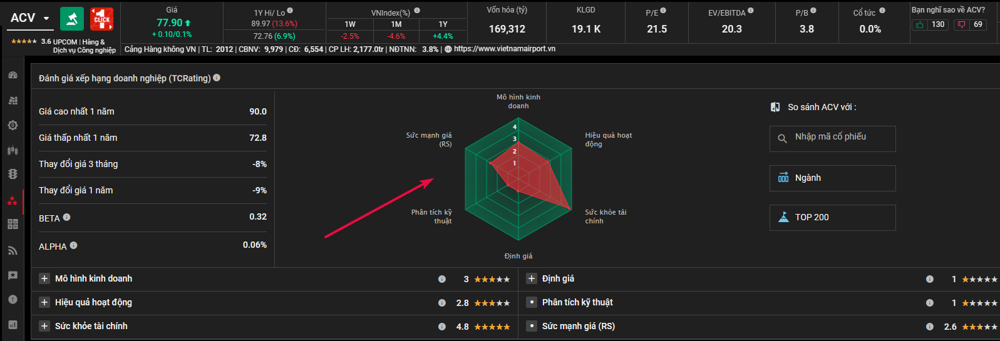

# Đánh giá & xếp hạng 

!!! tip "Lưu ý"
    Để tiện theo dõi và tra cứu, trong một số trường hợp chúng tôi sẽ xoay DataFrame trả về từ hàm với với phép `transpose` để thấy đầy đủ thông tin dễ hơn. Với các câu lệnh có phần kết thúc với `.T` tức là đang áp dụng phép `transpose` này.

## Chung



```python
general_rating("VNM")
```

- Kết quả:

```shell
>>> general_rating("VNM").T
                         0
stockRating            3.7
valuation              1.4
financialHealth        4.8
businessModel          3.9
businessOperation      2.8
rsRating               2.2
taScore                1.0
ticker                 VNM
highestPrice       80815.2
lowestPrice        63390.9
priceChange3m        0.016
priceChange1y       -0.018
beta                  0.36
alpha               0.0013
```


## Mô hình kinh doanh

```python
biz_model_rating("VNM")
```

- Kết quả:

```shell
>>> biz_model_rating("VNM").T
                          0
ticker                  VNM
businessModel           3.9
businessEfficiency        3
assetQuality              4
cashFlowQuality           4
bom                       4
businessAdministration    4
productService            4
businessAdvantage         4
companyPosition           4
industry                  4
operationRisk             4
```


## Hiệu quả hoạt động

```python
biz_operation_rating("VNM")
```

- Kết quả:

```shell
>>> biz_operation_rating("VNM").T
                                             0
industryEn                       Food Products
loanGrowth                                None
depositGrowth                             None
netInterestIncomeGrowth                   None
netInterestMargin                         None
costToIncome                              None
netIncomeTOI                              None
ticker                                     VNM
businessOperation                          2.8
avgROE                                       5
avgROA                                       5
last5yearsNetProfitGrowth                    1
last5yearsRevenueGrowth                      2
last5yearsOperatingProfitGrowth              1
last5yearsEBITDAGrowth                       1
last5yearsFCFFGrowth                         2
lastYearGrossProfitMargin                    4
lastYearOperatingProfitMargin                3
lastYearNetProfitMargin                      3
TOIGrowth                                 None
```

## Sức khỏe tài chính
```python
financial_health_rating("VNM")
```

- Kết quả:

```shell
>>> financial_health_rating("VNM").T
                              0
industryEn        Food Products
loanDeposit                None
badLoanGrossLoan           None
badLoanAsset               None
provisionBadLoan           None
ticker                      VNM
financialHealth             4.8
netDebtEquity                 4
currentRatio                  5
quickRatio                    5
interestCoverage              5
netDebtEBITDA                 5
```


## Định giá
```python
valuation_rating("VNM")
```

- Kết quả:

```
>>> valuation_rating("VNM").T
                          0
industryEn    Food Products
ticker                  VNM
valuation               1.4
pe                        1
pb                        1
ps                        1
evebitda                  1
dividendRate              4
```

## Sức khỏe tài chính ngành
```python
industry_financial_health("VNM")
```

- Kết quả:

```shell
>>> industry_financial_health("VNM").T
                     0
industryEn        None
loanDeposit       None
badLoanGrossLoan  None
badLoanAsset      None
provisionBadLoan  None
ticker             VNM
financialHealth    3.4
netDebtEquity        4
currentRatio         3
quickRatio           3
interestCoverage     3
netDebtEBITDA        3
```