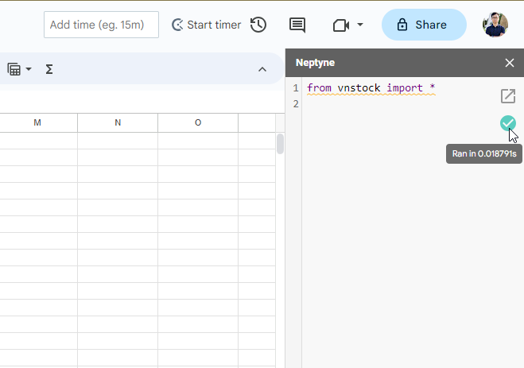

# vnstock trong Google Sheets
## Sử dụng tiện ích mở rộng Neptyne

!!! tip "Neptyne for Google Sheets"
    Neptyne là một tiện ích mở rộng cho phép sử dụng python ngay trong Google Sheets, các lệnh Python được chạy trên môi trường đám mây. Bạn có thể cài vnstock thông qua Neptyne và sử dụng để trích xuất dữ liệu chứng khoán Việt Nam một cách dễ dàng cho các dự án phân tích mà không cần phải sử dụng môi trường lập trình Python phức tạp. 

Để sử dụng vnstock qua Neptyne, bạn làm như sau:

1. Cài đặt Neptyne add-on cho Google Sheets [tại đây](https://workspace.google.com/marketplace/app/neptyne_python_for_sheets/891309878867)
2. Mở menu `Extensions` > `Neptyne for Google Sheets` > `Install Python Packages` từ file Google Sheets bất kỳ. Nếu bạn sử dụng ngôn ngữ tiếng Việt, bạn có thể tìm menu `Tiện ích mở rộng` và tìm các mục tương ứng
3. Nhập `vnstock` vào cửa sổ hiện ra và chọn `Apply` để áp dụng cài đặt. Quá trình cài đặt sẽ diễn ra trong chốc lát. Sau khi nhận thông báo cài đặt thành công, bạn có thể đóng cửa sổ hiện ra này bằng nút `Close`.
4. Mở menu `Extensions` > `Neptyne for Google Sheets` > `Show Code Editor`. Từ đây, nhập dòng lệnh `from vnstock import *` để Import tất cả các hàm `vnstock` vào Neptyne.
5. Thực thi lệnh Python trong Google Sheets bằng cách nhập hàm `=Py()` vào ô tính bất kỳ. Nhập tên hàm và các tham số tương ứng theo thứ tự. Ví dụ để gọi hàm lấy giá `stock_historical_data` ta sẽ cấu trúc như sau:

    - Hàm gốc trong Python:
        ```python
        stock_historical_data(symbol='GMD', 
                                    start_date="2023-10-01", 
                                    end_date='2023-10-20', resolution='1D', type='stock', beautify=True)
        ```
    - Nhập trong Google Sheets:
        ```
        =Py("stock_historical_data", "GMD","2023-10-01", "2023-10-20","1D","stock", "True")
        ```
    
    !!! tip "Lưu ý"
        Khi sử dụng các hàm Python trong Neptyne, thay vì nhập như cú pháp Python thông thường, bạn nhập tên hàm và các tham số lần lượt, ngăn cách nhau bởi dấu phẩy `,` đồng thời các giá trị nhập vào được đặt trong ngoặc kép `""`

=== "Bước 2. Cài đặt vnstock"
    
=== "Bước 3. Nhập `vnstock` và chọn `Apply`"
    

    Thông báo cài đặt thành công hiện ra trong giây lát.

    
=== "Bước 4. Import hàm"
    
    
    Nạp các hàm vnstock vào Neptyne. Tích xanh hiện ra thể hiện quá trình thực thi lệnh thành công.

    
=== "Bước 5. Chạy hàm vnstock để lấy dữ liệu"
    


## Chuyển đổi hàm Python sang Google Apps Script
vnstock cung cấp một hàm tùy biến làm mẫu giúp bạn hình dung và bắt đầu chuyển đổi các hàm python được cung cấp bởi vnstock sang ngôn ngữ Google Apps Script để sử dụng với Google Sheets. Bạn có thể đóng góp vào mã nguồn dự án giúp vnstock hoàn thiện đầy đủ các tính năng cho Google Sheets và lan tỏa tới cộng đồng.

Để sử dụng thử đoạn code trên cho việc lấy dữ liệu, bạn làm như sau:

1. Mở file [source code vnstock_gg_sheet](https://github.com/thinh-vu/vnstock/blob/main/vnstock_gg_sheet/vnstock._appscript.js) và copy đoạn code.
2. Mở hoặc tạo 1 file Google Sheets bất kỳ
3. Từ menu của Google Sheets, tìm mục Extension (tiện ích mở rộng) > Apps Script như trong hình. 
4. Trong giao diện Apps Script Editor, xóa hết code hiện tại và ghi đè với đoạn code bạn copy từ source code ở trên 
5. Save file (Ctrl/Cmd + S) để lưu thay đổi.
6. Chuyển qua Google Sheets, bạn đã có thể nhập các tham số cho hàm và sử dụng như bình thường. Ví dụ: `= derivativesOhlc("VN30F1M", "2023-06-01", "2023-09-26", "15")`

=== "Bước 3. Mở Google Apps Script Editor"
    

=== "Bước 4. Paste đoạn code mẫu & chỉnh sửa"
    

=== "Bước 6. Gọi hàm tùy chỉnh từ bảng tính"
    

!!! tip "Gợi ý"
    Để chuyển đổi các hàm python hiện tại do vnstock cung cấp, bạn có thể sử dụng công cụ ChatGPT để thực hiện. Bạn sẽ cần có chút kiến thức về JavaScript để có thể tùy biến các hàm này nhanh chóng. Nếu không sẽ cần kỹ năng prompt engineering tốt để có thể yêu cầu AI hỗ trợ. Xa hơn, khi có nguồn lực, tôi sẽ cung cấp Add-in cho Google Sheets để các bạn có thể sử dụng dễ dàng hơn. Bạn có thể xem video hướng dẫn dưới đây để hiểu cách dùng ChatGPT hỗ trợ chuyển đổi hàm Python sang JavaScript.

<iframe width="800" height="452" src="https://www.youtube.com/embed/w4GCFZUpsEY?si=r77JMNc2p-SUihI5" title="YouTube video player" frameborder="0" allow="accelerometer; autoplay; clipboard-write; encrypted-media; gyroscope; picture-in-picture; web-share" allowfullscreen></iframe>
