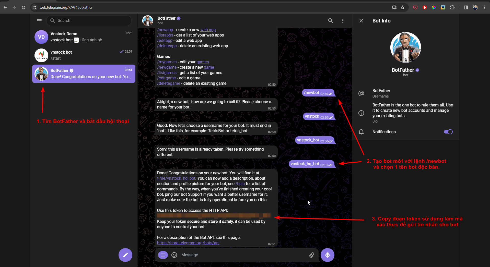

# Gửi tin tức, cảnh báo qua Telegram, Slack

!!! abstract "Giới thiệu"
    vnstock cung cấp tới bạn các hàm kết nối tới [Telegram API](https://core.telegram.org/) và [Slack API](https://api.slack.com/) cho phép gửi tin nhắn, hình ảnh qua Slack channel và Telegram group. Đây là tính năng mở ra các ứng dụng gửi tin tức, cảnh báo giao dịch và các thông tin quan trọng tới bạn mà không cần đi qua bất kỳ dịch vụ trung gian nào.

Để sử dụng tính năng này bạn có thể sử dụng code mẫu trong file demo notebook chung của vnstock. Cú pháp của hàm tương đối đơn giản.

## Telegram

Tạo Telegram bot đầu tay là một quá trình tương đối đơn giản, bạn có thể thực hiện toàn bộ các công đoạn để có thể gửi được tin nhắn trong chưa đầy 15 phút.

=== "1. Tạo bot với BotFather"
    !!! tip "Gợi ý"
        1. Nếu bạn không muốn sử dụng bot chung với tài khoản Telegram hiện có vì lý do bảo mật thì cần bắt đầu tạo tài khoản mới với App Telegram trên Smartphone trước khi bắt đầu. 

        2. Đăng nhập telgram web để tạo và thiết lập bot. 
        
        3. Copy đoạn token và lưu giữ cẩn thận để bảo mật.

    
=== "2. Thiết lập thông tin bot"
    !!! tip "Gợi ý"
        Bước này chỉ đơn giản là cập nhật ảnh đại diện và mô tả của bot để dễ phân biệt với tài khoản thông thường.

    
=== "3. Gửi tin nhắn"
    !!! tip "Gợi ý"
        1. Copy ID của nhóm chat để sử dụng cho hàm gửi tin nhắn.
        2. Sử dụng đoạn code do vnstock cung cấp để gửi tin nhắn
        3. Tận hưởng thành quả: tin nhắn gửi từ API thành công
    
    

```python
from vnstock.integration import * # Nếu đã nạp tất cả hàm thì bỏ qua.

token_key = 'TOKEN_KEY_CỦA_BẠN'
chat_id = 'ID_NHÓM_CHAT'
message = 'Tin nhắn của bạn'
file_path = 'ĐƯỜNG_DẪN_ĐẾN_FILE_HÌNH_TRÊN_MÁY_TÍNH'
```

- Gửi tin nhắn kèm hình: `telegram_send_photo(token_key, chat_id, message, file_path)`


- Gửi tin nhắn văn bản: `telegram_send_message(token_key, chat_id, message)`

!!! success "Tham khảo"
    Tham khảo bài viết trên Thịnh Vũ Blog [tại đây](https://thinhvu.com/2021/04/11/tao-telegram-bot-lap-trinh-ung-dung-python/) và [đây nữa](https://thinhvu.com/2021/04/11/tao-alert-bot-telegram-chi-phi-facebook-ad/) để hiểu hơn về các bước thiết lập Telegram Bot trước khi bạn có thể cấu hình các hàm gửi tin nhắn dưới đây. Thịnh cũng sẽ cập nhật lại hướng dẫn mới nhất trong thời gian tới.
    

## Slack

Tương tự với các hàm sử dụng cho Telegram. Bạn có thể thiết lập cấu hình nhắn tin tới 1 channel Slack bất kỳ bằng các hàm dưới đây.

```python
from vnstock.integration import * # Nếu đã nạp tất cả hàm thì bỏ qua.

token_key = 'TOKEN_KEY_SLACK_CỦA_BẠN'
slack_channel = 'TÊN_CHANNEL'
message = 'Tin nhắn của bạn'
file_path = 'ĐƯỜNG_DẪN_ĐẾN_FILE_HÌNH_TRÊN_MÁY_TÍNH'
```

Bây giờ thì bạn đã sẵn sàng để lựa chọn 1 trong 2 hình thức gửi tin nhắn

- Gửi tin kèm hình: 

```python
slack_send_file(token_key, slack_channel, text_comment, file_path)
```

- Gửi tin nhắn văn bản: 

```
pythonslack_send_message(token_key, slack_channel, message)
```

Trong đó:

- `token_key`: Bạn có thể sử dụng bot token bắt đầu với `xoxb-..` hoặc user token bắt đầu với `xoxp-..`
- `slack_channel`: là tên channel, bắt đầu với `#` ví dụ `#market_trend`
- `text_comment`: caption cho file hình ảnh gửi kèm
- `file_path`: đường dẫn tới file hình ảnh trên máy tính
- `message`: là nội dung tin nhắn